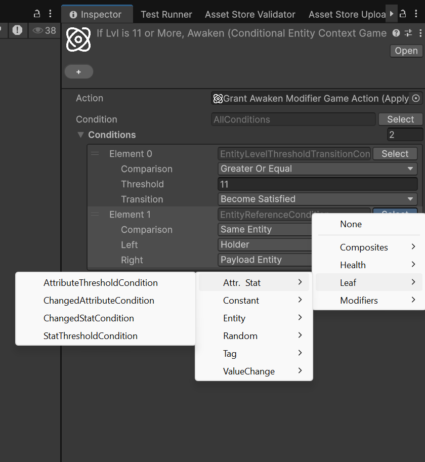
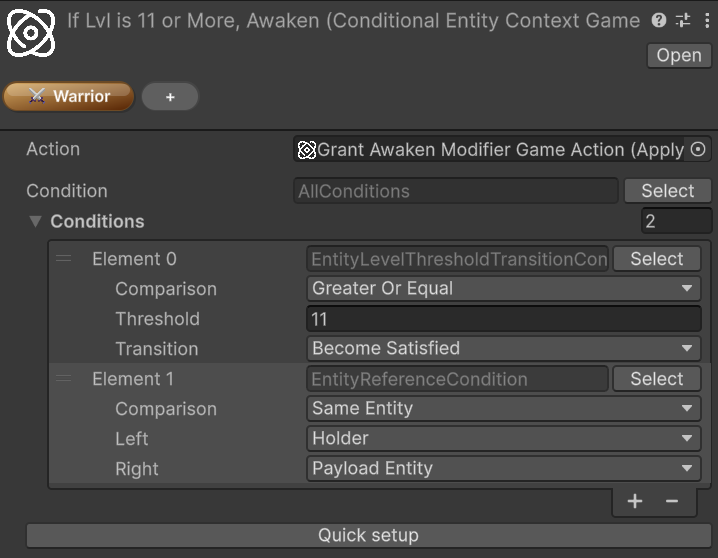

# Conditions

*🏷️ Version 2.0.0+*

> [!WARNING]
> The `Conditions` system is currently experimental and may change at any time.
>
> Be careful when adopting it for production-critical features. Future package updates may require refactoring condition trees, revisiting authoring workflows, or adjusting integration code that depends on the current behavior.
>
> The feature is expected to move toward a more stable shape once Astra Modifiers is released, where `Condition`s are used extensively. Until then, it is safer to treat the current API and authoring flow as provisional.

`Condition`s are reusable predicates evaluated against an `EvaluationContext`. They let you express editor-authored rules such as "run this action only when the holder is below a threshold", "only pass when the payload entity matches the holder", or "only continue when the target has a required tag set".

Unlike `GameTag`s or `GameAction`s, conditions are usually not standalone assets. They are authored inline in `[SerializeReference]` fields, where you choose a concrete condition type from a grouped picker and configure it directly in the Inspector.

## The condition model

Every concrete condition derives from `Condition` and implements `Evaluate(EvaluationContext ctx)`.

The evaluation context carries the runtime references that built-in conditions inspect:

| Context value | Typical meaning |
|---|---|
| `Holder` | The entity that owns the evaluated effect or action |
| `Performer` | The entity that applied or cast the effect, when available |
| `EventPayload` | The current trigger payload or event data |

`EvaluationContext` also exposes `TryGetPayload<T>()` when a condition needs typed access to the current payload.

Many built-in conditions resolve one of these context slots before applying their actual check. For example, an entity condition may compare the holder against a payload entity, while a tag condition may inspect the resolved entity for one or more required tags.

## Context contracts and payload roles

Many of the less obvious conditions are really about **which contracts the current payload implements**. The system does not rely on a single event-context base class. Instead, conditions look for small focused interfaces that describe what the payload can provide.

### Common context contracts

| Contract | Meaning |
|---|---|
| `IHasEntity` | Exposes the payload's primary entity |
| `IHasTarget` | Exposes the target entity of the payload |
| `IHasPerformer` | Exposes the entity that performed or caused the action |
| `IHasVictim` | Exposes the victim entity when that role exists |
| `IHasValueChange<T>` | Exposes `PreviousValue`, `NewValue`, and `AbsAmount` for numeric-change payloads |

`IHasEntity` is the most important bridge contract in the framework. It represents the primary entity carried by a payload, and it is also the interface that lets many `GameAction<IHasEntity>` workflows accept both entity components and event payloads in a consistent way.

### How `ConditionTarget` resolves entities

Entity-based and tag-based conditions select an entity slot through `ConditionTarget`:

| Target slot | Resolved from |
|---|---|
| `Holder` | `EvaluationContext.Holder` |
| `Performer` | `EvaluationContext.Performer` |
| `PayloadEntity` | `IHasEntity` on the payload, or the `EntityCore` of a payload `Component` |
| `PayloadPerformer` | `IHasPerformer` on the payload |
| `PayloadTarget` | `IHasTarget` on the payload |
| `PayloadVictim` | `IHasVictim` on the payload |

This is why some conditions appear to "just work" with certain event payloads and not with others: the payload must actually expose the requested role.

### Common payloads used by built-in conditions

Several built-in event payloads already expose the contracts that the condition system expects:

| Payload type | Contracts | Typical use |
|---|---|---|
| `StatChangeInfo` | `IHasEntity`, `IHasTarget`, `IHasValueChange<long>` | Stat-based conditions and long value-change conditions |
| `AttributeChangeInfo` | `IHasEntity`, `IHasTarget`, `IHasValueChange<long>` | Attribute-based conditions and long value-change conditions |
| `EntityLevelChangedContext` | `IHasEntity`, `IHasTarget`, `IHasValueChange<int>` | Entity level conditions and int value-change conditions |

For example, `StatChanged`, `AttributeChanged`, `EntityLevelUp`, and `EntityLevelDown` payloads already expose the entity and value-change contracts needed by the related condition families.

## Built-in condition families

The type picker groups the built-in condition library into several families:

### `Composites`

Use these to combine or transform other conditions:

- `AllConditions`: logical AND; every child must pass, and an empty list evaluates to true
- `AnyCondition`: logical OR; at least one child must pass, and an empty list evaluates to false
- `NoneCondition`: logical NOR; no child may pass, and an empty list evaluates to true
- `NotCondition`: inverts a single inner condition; if the inner value is null, it evaluates to true
- `AtLeastNCondition`: passes when at least `N` child conditions pass
- `AtMostNCondition`: passes when at most `N` child conditions pass
- `ExactlyNCondition`: passes when exactly `N` child conditions pass

These are the main building blocks for condition trees that need more than one rule. `AtLeastNCondition`, `AtMostNCondition`, and `ExactlyNCondition` are especially useful when you want a count-based rule instead of a strict AND/OR shape.

### `Leaf/Constant`

Simple fixed predicates:

- `AlwaysTrueCondition`: always passes
- `AlwaysFalseCondition`: never passes

These are useful as placeholders or for testing larger composite trees.

### `Leaf/Attr. & Stat`

Conditions in this family evaluate attributes, stats, or stat/attribute-related payloads:

- `AttributeThresholdCondition`: resolves an entity slot, reads one attribute from that entity, and compares it against a threshold
- `StatThresholdCondition`: resolves an entity slot, reads one stat from that entity, and compares it against a threshold
- `ChangedAttributeCondition`: checks whether the current payload is an `AttributeChangeInfo` for a specific `Attribute`
- `ChangedStatCondition`: checks whether the current payload is a `StatChangeInfo` for a specific `Stat`

Threshold-based conditions operate on the current value stored on the resolved entity. By contrast, `ChangedAttributeCondition` and `ChangedStatCondition` do not compare numbers at all: they only verify which attribute or stat the current change payload refers to.

`AttributeThresholdCondition` can also work in percentage mode, where the current value is interpreted as a percentage of the attribute's configured range.

### `Leaf/Entity`

These conditions reason about entity roles and entity relationships in the evaluation context:

- `EntityReferenceCondition`: compares two selected entity slots such as holder, payload entity, performer, target, or victim
- `EntityLevelCondition`: resolves one entity slot and compares that entity's **current** level against a threshold
- `EntityLevelThresholdTransitionCondition`: reads an `int` value-change payload and checks whether a level comparison became satisfied or became unsatisfied across the change
- `HolderLevelCondition`: a shorter holder-only version of a level comparison
- `IsPerformerCondition`: passes when `Performer` and `Holder` are the same entity

This family is especially useful when you need to distinguish self-targeting, compare holder and payload entity, or react only at specific level boundaries.

Some practical reading tips:

- `EntityReferenceCondition` is the most general entity-role matcher. It is ideal when the meaning of the rule depends on relationships such as "holder equals payload entity" or "payload target is different from performer"
- `EntityLevelCondition` looks at the entity's current live level, not at a before/after transition
- `EntityLevelThresholdTransitionCondition` is for level-change payloads and asks whether a rule changed state across the event (for example, whether `level >= 10` just became true)
- `HolderLevelCondition` is simpler than `EntityLevelCondition`, but also less flexible because it cannot look at payload roles
- `IsPerformerCondition` is mainly useful in self-applied or self-triggered workflows

> [!NOTE]
> `PayloadEntity` is often the most useful slot when working with built-in event payloads, because types such as `StatChangeInfo`, `AttributeChangeInfo`, and `EntityLevelChangedContext` already implement `IHasEntity`.

### `Leaf/Tag`

The tag-focused family lets conditions inspect tags on resolved entities or on active modifier data:

- `EntityHasTagCondition`: resolves one entity slot and checks whether that entity's tags match a configured `GameTagSet`
- `HasActiveModifierTagCondition`: checks whether the holder currently has at least one active modifier whose tags match the configured set

`EntityHasTagCondition` supports both **Any Of** and **All Of** matching against a configured `GameTagSet`. `HasActiveModifierTagCondition` relies on `IActiveModifierTagProvider`, so it is mainly relevant when the holder is participating in modifier-based workflows. For the tagging workflow itself, see [Game Tags](game-tags.md).

### `Leaf/ValueChange`

These conditions are designed for payloads that carry value-delta information through `IHasValueChange<T>`.

All of them read one of these projections:

- `PreviousValue`
- `NewValue`
- `AbsAmount`

The built-in numeric payloads are split by type:

- `EntityLevelChangedContext` provides `IHasValueChange<int>`
- `StatChangeInfo` and `AttributeChangeInfo` provide `IHasValueChange<long>`

> [!NOTE]
> This is why the payloads used by built-in events such as entity level up, entity level down, stat changed, and attribute changed work naturally with the `Leaf/ValueChange` family: they already implement `IHasValueChange<T>`.

The available conditions are:

- `IntValueChangeDirectionCondition`: checks whether an `int` payload increased, decreased, or stayed the same
- `IntValueChangeModuloCondition`: applies a modulo rule to a projected `int` value
- `IntValueChangeThresholdCondition`: compares a projected `int` value against a threshold
- `IntValueChangeThresholdTransitionCondition`: checks whether an `int` threshold comparison became satisfied or unsatisfied across the change
- `LongValueChangeDirectionCondition`: checks whether a `long` payload increased, decreased, or stayed the same
- `LongValueChangeModuloCondition`: applies a modulo rule to a projected `long` value
- `LongValueChangeThresholdCondition`: compares a projected `long` value against a threshold
- `LongValueChangeThresholdTransitionCondition`: checks whether a `long` threshold comparison became satisfied or unsatisfied across the change

They are useful when the interesting rule is not the absolute final value, but the way a value changed.

This distinction matters:

- **Direction** conditions care only about increase, decrease, or equality
- **Threshold** conditions evaluate a single projected value such as `NewValue >= 10`
- **Threshold transition** conditions evaluate whether the comparison changed state between previous and new values
- **Modulo** conditions are useful for cyclical checks on the projected value, such as verifying that a `NewValue` level lands on 5, 10, 15, ... or that another projected value repeats on a fixed remainder pattern

For example, if a level changes from 9 to 10:

- `IntValueChangeThresholdCondition` with `NewValue >= 10` passes because the new value is 10
- `IntValueChangeThresholdTransitionCondition` with `>= 10` and **Become Satisfied** passes because the comparison was false before and true after

### `Leaf/Random`

Randomized gating is provided through:

- `RandomChanceCondition`: passes with the configured percentage chance

This condition evaluates to true based on a configured percentage chance.

## Authoring conditions in the Inspector

Because conditions are managed-reference values, the typical workflow is:

1. Locate a field that accepts a `Condition`
2. Open the type picker for that field
3. Choose a concrete condition from the grouped menu
4. Configure its fields, such as target entity slot, comparison mode, threshold, or required tag set
5. Wrap the root in composites if the rule needs multiple checks



> [!NOTE]
> Conditions are authored inline, so their serialized data lives inside the object that owns the field. You do not create a standalone `Condition` asset first and reference it later.

## Extending the system with custom conditions and triggers

The payload filter shown by reactive inspectors is metadata-driven. If you add your own `Condition` subclasses or your own `IReactiveTrigger` implementations, treat that metadata as part of the public contract of the type.

### Custom `Condition` types

If a custom condition reads `EvaluationContext.EventPayload`, annotate it with one or more `ConditionPayloadAttribute`s:

```csharp
using System;
using ElectricDrill.AstraRpgFramework.Conditions;
using ElectricDrill.AstraRpgFramework.Contexts;

[Serializable]
[ConditionPayload(typeof(IHasEntity))]
[ConditionPayload(typeof(IHasPerformer))]
public sealed class PayloadActorMatchesHolderCondition : Condition
{
    public override bool Evaluate(EvaluationContext ctx)
    {
        if (!ctx.TryGetPayload<IHasEntity>(out var payload))
            return false;

        return payload.Entity == ctx.Holder;
    }
}
```

Use these rules:

- Add one attribute per accepted payload contract. Multiple attributes are an **OR** list.
- Prefer the narrowest interface or base type that the condition actually needs, such as `IHasEntity` or `IHasValueChange<long>`, instead of overfitting to one concrete payload class.
- Omit the attribute entirely only for payload-agnostic conditions. A condition with no `ConditionPayloadAttribute` is treated as compatible with any trigger.
- If a condition requires payload data and you forget the attribute, the condition may still appear in filtered pickers because the editor has no metadata proving otherwise.

### Custom `IReactiveTrigger` types

Custom triggers must expose the payload contract through `IReactiveTrigger.PayloadType`:

```csharp
using System;
using ElectricDrill.AstraRpgFramework.Triggers;

[Serializable]
public sealed class CustomStatusTrigger : IReactiveTrigger
{
    public Type PayloadType => typeof(CustomStatusEvent);

    // Subscribe / Unsubscribe / EventSource omitted.
}
```

Best practices:

- Return `typeof(void)` for parameterless triggers.
- Return the type that subscribers can safely assume at runtime. If the trigger is conceptually based on an interface contract, expose that interface instead of an arbitrary concrete implementation.
- Do not use `typeof(object)` unless the payload is genuinely unconstrained, because it disables meaningful filtering.

When both sides provide accurate metadata, the framework can filter incompatible condition types in the Inspector and warn about already-authored invalid trees before play mode.

For custom editor wiring that connects a trigger field to a condition field and enables this filtering automatically, see [Payload-aware condition fields in custom editors](advanced-topics.md#payload-aware-condition-fields-in-custom-editors).

## Conditional game actions

The most direct built-in use of the system is `ConditionalGameAction<TContext>`, which wraps another `GameAction<TContext>` with an optional guard condition.

- `Astra RPG Framework/Game Actions/Context: Entity/Conditional`
- `Astra RPG Framework/Game Actions/Context: Component/Conditional`

If the configured condition evaluates to `false`, the nested action is skipped. If the condition field is left empty, the action behaves as always allowed.

The custom inspector for conditional actions also exposes a **Quick setup** row below the condition field. This is meant to speed up structural edits to the root condition tree:

- Wrap the current root in `AllConditions`
- Wrap the current root in `AnyCondition`
- Wrap the current root in `NotCondition`
- Unwrap the current root when the current shape supports it



For the broader `GameAction` workflow, see [Game Actions](workflows.md#game-actions).

## Practical uses

`Condition`s are especially useful for:

- Gating a `GameAction` so it only runs for certain entities or payload states
- Comparing holder, performer, and payload entity roles without writing custom glue code
- Reacting only when an attribute or stat crosses a threshold
- Filtering tag-aware behavior through `GameTagSet` matching
- Adding probabilistic behavior through a reusable chance-based condition

The main strength of the system is composition. Instead of hardcoding special-case checks into every consumer, you can assemble reusable condition trees directly in the Inspector and keep the rule logic close to the data that depends on it.
