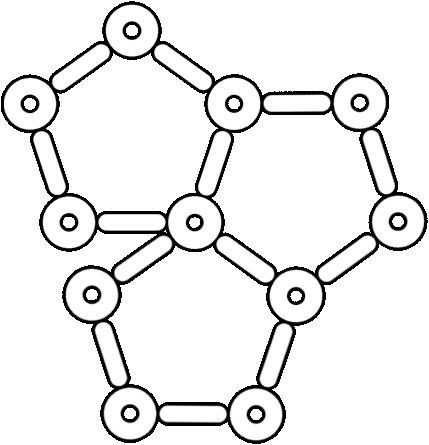

# Introduction
Whether you are creating a traditional RPG, a roguelike, an MMO, or even a game with unique mechanics, Simple RPG Core can adapt to your needs. By providing a robust framework for managing attributes, statistics, levels, classes, and more, it allows you to focus on the creative aspects of game development, simplifying the implementation of the more monotonous parts with a scalable and maintainable 100% inspector-driven experience.  

The final outcome should look like this:
(TODO) add image

## Vocabulary of Simple RPG Core
The package is developed around the concept of _entity_, so let's clarify what we mean by this term in the context of Simple RPG Core. In its most minimal version, an entity is a `GameObject` that has a set of statistics. Optionally, an entity can have attributes, can level up, and can have a class.
Let's clarify what we mean by each mentioned term.

### Statistics (Stat)
A statistic is a value that quantifies an aspect of the entity. The meaning of this aspect is solely due to the concept it refers to.
#### Examples
In an RPG, a statistic can be `physical damage`. The concept of physical damage refers the player to the amount of damage inflicted by physical attacks, whether with weapons or without. Other statistics can be `ability power`, `defense`, `speed`, `armor penetration`, `range`, etc.

### Attributes
An attribute is a value that can influence the value of one or more statistics. The weight of its influence on the statistics can be variable.
#### Examples
In an RPG, attributes can be: `strength`, `dexterity`, `intelligence`, `constitution`, etc. Considering the previous example of statistics, `strength` could influence `physical damage`, `dexterity` would increase `speed`, `intelligence` would increase `ability power`, and `constitution` would increase `defense`.

### Experience and Level
The entity can gain experience and level up. This functionality is used by the class to express how attributes and statistics grow with levels, for that particular class.

### Class
The class is associated with a set of statistics and optionally a set of attributes. The class describes how statistics and attributes vary with levels.
#### Examples
In RPGs most common classes are: `warrior`, `rogue`, `mage`, `paladin`, and so on. These classes have different attribute values. For example, a warrior will have more `strength` and `constitution` than a mage. The `rogue` might have the highest `dexterity`, etc.

## How is Simple RPG Core organized and how does it work?

### Entity
*Script icon:*   

A `GameObject` becomes an entity once the `EntityCore` and `EntityStats` `MonoBehaviour`s (Mono) are added to it. `EntityCore` comes with a built-in `EntityLevel` (plain C# `class`) that manages the experience and the level of the entity.

### Stat
*Script icon:*   

A `Stat` is a class that derives from `ScriptableObject` (SO) and represents a statistic in the game. Each statistic has a name (the name given to the SO instance of the created `Stat`), and we can choose whether to provide it with a maximum and/or minimum value. Additionally, we can define how that statistic grows or is reduced in function of certain `Attributes`.

### StatSet
*Script icon:*   

A `StatSet` is a class that derives from SO and defines a set of `Stat`s.

### EntityStats
*Script icon:*   

`EntityStats` allows us to configure:
- the base statistics
- the flat modifiers
- the _StatToStat_ modifiers
- the percentage modifiers

We will see what these modifiers are in the section (TODO).

The base statistics can be _fixed_, or instead derive from a class if the entity has one assigned. If we use the fixed ones, we must also provide a `StatSet`, while if we use those of a class, the class's `StatSet` will be used. If the entity levels up and we want its statistics to grow with levels, we are forced to use a class, as the _fixed_ statistics are immutable.

### Class
*Script icon:*   

`Class` derives from SO and represents a game class. Each class has a name, a `GrowthFormula` that defines how the base Max HP grows with levels, a `StatSet`, optionally an `AttributeSet`, and associates each `Stat` of the provided StatSet with a `GrowthFormula` that describes how the statistic varies with levels. Similarly, if an `AttributeSet` is provided, it will be possible to associate a `GrowthFormula` for each `Attribute` present in the set, to describe how the attributes vary with levels.

### EntityClass
*Script icon:*   

`EntityClass` derives from Mono and allows us to assign a `Class` to our entity.

### Attribute
*Script icon:*   

An `Attribute` is a class that derives from SO and represents an attribute in the game. Each attribute has a name and, like statistics, can have a maximum and minimum value.

### AttributeSet
*Script icon:*   

An `AttributeSet` is a class that derives from SO and defines a set of `Attribute`s.

### EntityAttributes
*Script icon:*   

Optionally, we can add the Mono `EntityAttributes` to our entity if we want to give it attributes. `EntityAttributes` allows us to specify how many attribute points to provide at each new level. These points can be spent on various attributes to increase their value. For `EntityAttributes` we can configure:
- the base attributes
- the flat modifiers
- the percentage modifiers
Similarly to `EntityStats`, we can decide whether the base attributes are _fixed_ or if they instead derive from the class associated with `EntityClass`.

### Growth Formula
*Script icon:* 

To express how `Stats`, `Attributes`, Max HP, and the experience required to level up vary at each level, we can use instances of `GrowthFormula`. This is a class that derives from SO and allows us to define a mathematical function, or a system of functions, that describe how a value changes as levels increase. We will see in more detail how to define a `GrowthFormula` in (TODO).

### Scaling Formula

*Script icon:* 

Although we haven't mentioned `ScalingFormula` until now, we briefly introduce it here before discussing it in detail in (TODO).  
`ScalingFormula` is a class that derives from SO and allows us to define how a value changes based on other values. In the most common case, the scaling formula is defined in terms of statistics and/or attributes. Each `ScalingFormula` consists of a base value, fixed or defined through a `GrowthFormula`, and a series of `ScalingComponent`s. The `ScalingComponent` define the scaling for a certain type of values. The package provides `StatScalingComponent` and `AttributeScalingComponent`.

`ScalingFormula`s are highly flexible components that can be used in various contexts, such as the damage inflicted by abilities. For example, suppose our character has an ability called `Mace Slam`, which deals `100 + (physical damage * 1.5)` damage. The `ScalingFormula` of `Mace Slam` will have a base damage of 100 and a `StatScalingComponent` that associates the `physical damage` statistic with a 1.5x scaling.

The `ScalingFormula` allows us to insert the various `ScalingComponent`s into two collections: one that refers to the user of the value and one for the potential target. In the previous example, the `StatScalingComponent` referred to the user's collection (of the ability): the higher the `physical damage` of our character, the greater the damage inflicted. Nothing prevents us from adding any `ScalingComponent` based on certain values possessed by the target. For example, we can add a `StatScalingComponent` to the "target" collection that calculates `defense * 0.5` as an additional damage value. Therefore, the higher the defense of the target of our ability, the greater the damage inflicted on it by `Mace Slam`.

### Scaling Component
As mentioned in [Scaling Formula](#scaling-formula), it can constitute a part of the `ScalingFormula` to define how the final value scales with one or more values that belong to the same categories. We have seen the `StatScalingComponent` in the example previously.  
It is worth mentioning that the scaling of a `Stat` in function of the `Attribute`s, mentioned in the [Stat](#stat) paragraph, is defined through an `AttributeScalingComponent`.

## How is Simple RPG Core implemented?
The package is developed following the principles of SOAP (Scriptable Object Architecture Pattern), and has been inspired by the [GDC talk of Ryan Hipple](https://www.youtube.com/watch?v=raQ3iHhE_Kk&ab_channel=Unity). In a nutshell, the main benefits provided by this architecture are:
- **encapsulation**: separation of game logic from data. Game logic code shouldn't mix with data. All data is nicely wrapped withing SO instances
- **game designers friendly**: game designers can make changes and balancements from the inspector without touching the code
- **greater reusability**: Each object is a `ScriptableObject` that can be reused by many components
- **greater testability**: being data separated from code, is easier to isolate and fix bugs. Moreover, SO events can be raised with ease at the press of a button from the inspector interface, easing and speeding up debugging even further.

## Flexibility of Simple RPG Core
Although the package is specifically designed for RPG games or games with progression systems, its flexibility allows it to be used in almost any game. As it allows creating attributes like `strength`, `dexterity`, `agility`, etc., and statistics such as `physical damage`, `magic power`, `defense`, etc., in RPG, Roguelike, MMO games, etc., nothing prevents it from being used, for example, to implement a firearm. The attributes could be `weight`, `size`, `ergonomics`, etc., and the statistics `recoil`, `handling`, `stability`, `intimidation`, etc. Attributes can influence statistics. A heavier weapon could reduce `handling` but increase `stability`. A larger weapon could reduce `handling` but increase `intimidation`. A more ergonomic weapon could reduce `recoil` and increase `handling`. And so on... The weapon's levels, if present, influence the attributes and statistics, progressively improving them. Classes could represent weapon types (assault rifles, snipers, shotguns, etc.), and each class could have its own set of dedicated attributes and statistics. For example, shotguns could have, in addition to the aforementioned ones, the `barrel length` attribute that influences the `pellet spread` statistic.
