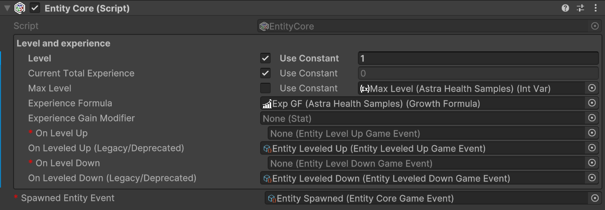
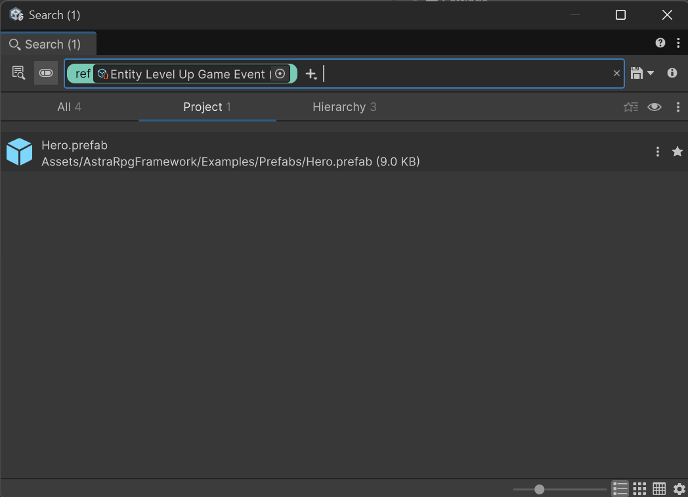
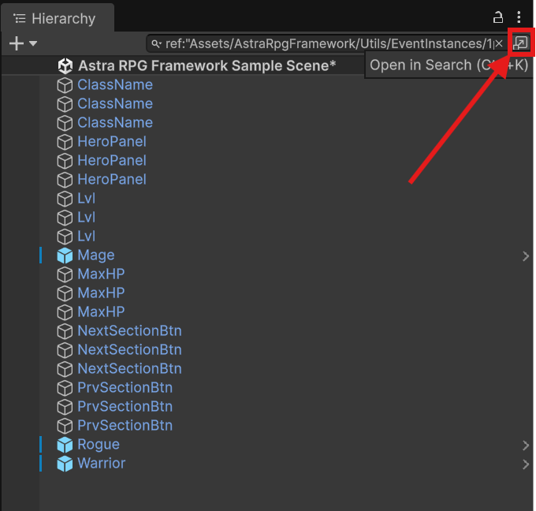
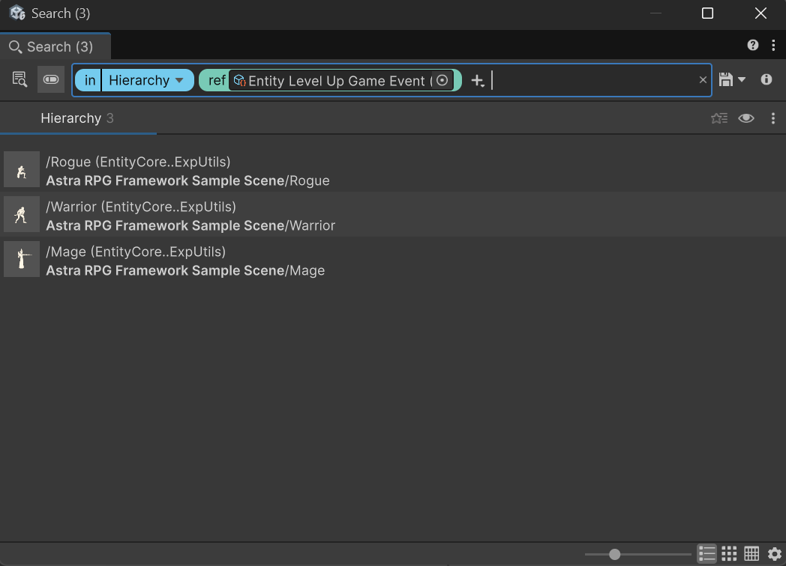

# Migration Guide

## Migrating to v2.0.0

v2.0.0 introduces new major subsystems such as Conditions, Game Tags, reactive triggers, and global framework configuration. Most of these additions are additive, but this release also includes a few breaking API changes and some behavior changes that existing projects should review carefully.

> [!CAUTION]
> Before upgrading to `v2.0.0`, you must already have completed the migrations for older deprecated features that are permanently removed in this release:
> - **Legacy `EntityLeveledUpGameEvent` / `EntityLeveledDownGameEvent` and their listeners** — see the `v1.4.0` section of [Changelog](changelog.md) and [Migrating to v1.4.0](#migrating-to-v140).
> - **`AttributePointsTracker`** — see the `v1.3.0` section of [Changelog](changelog.md), where `EntityPointsTracker` replaced the legacy tracker. If your project comes from a pre-`v1.3.0` setup, open and save the affected prefabs, scenes, and assets on a `v1.3.x+` version before moving to `v2.0.0`.
> - **`DerivedTypePicker`** — see the `v1.2.0` section of [Changelog](changelog.md), where it was deprecated in favor of `TypeSelectionMenu`.

### 1. Back up your project

Before updating, make sure your project is backed up or committed to version control. This release changes both runtime APIs and event wiring expectations, so it is worth having a safe rollback point.

### 2. Update the package from the Package Manager

Open Unity and navigate to `Window -> Package Management -> Package Manager` (`Window -> Package Manager` for older versions of the editor). Locate Astra RPG Framework in the "In This Project" list and update it to `2.0.0` (or the latest available). Let Unity finish recompiling before starting the migration work below.

### ScriptableObject type renames (SO suffix)

v2.0.0 adds an `SO` suffix to all core ScriptableObject types to make their `ScriptableObject` nature explicit at a glance. The following types were renamed:

| Old name | New name |
|---|---|
| `Stat` | `StatSO` |
| `Attribute` | `AttributeSO` |
| `Class` | `ClassSO` |
| `StatSet` | `StatSetSO` |
| `AttributeSet` | `AttributeSetSO` |
| `GrowthFormula` | `GrowthFormulaSO` |
| `ScalingFormula` | `ScalingFormulaSO` |
| `ScalingComponent` | `ScalingComponentSO` |
| `AttributesScalingComponent` | `AttributesScalingComponentSO` |
| `StatsScalingComponent` | `StatsScalingComponentSO` |
| `IntVar` | `IntVarSO` |
| `LongVar` | `LongVarSO` |
| `GameTag` | `GameTagSO` |
| `BoundedValue` | `BoundedValueSO` |

All renamed types carry `[MovedFrom(autoUpdateAPI = true)]`. Unity's API Updater rewrites C# script references automatically the first time the project recompiles after the upgrade.

> [!NOTE]
> If any symbol still appears broken after reimporting, update the reference manually to match the new name in the table above.

#### Do you use `[SerializeReference]` with any of these types as generic arguments?

Unity's `[MovedFrom]` patches direct (non-generic) `[SerializeReference]` managed references automatically. However, due to [Unity bug UUM-44729](https://issuetracker.unity3d.com/issues/movedfrom-attribute-is-not-working-for-generic-types), it cannot rewrite renamed types that appear as **generic arguments** inside a serialized type string.

If any of the following apply to your project, you need to run the migration tool and follow the additional steps in [Managed Reference Migration](managed-reference-migration.md):

- You have a `[SerializeReference]` field whose concrete serialized type holds one of the renamed framework types as a generic argument (for example, a custom closed-generic provider like `SomeProvider<Stat>`)
- You implemented `IDisplaySONameProvider<T>`, which has been replaced by the non-generic `IDisplaySONameProvider` (see [Migrating `IDisplaySONameProvider<T>`](managed-reference-migration.md#1-migrating-idisplaysonamet-custom-implementations))

If neither applies, no further action is needed for this section.

### Required migration steps

#### Update the framework configuration and shared event assets

The framework now dispatches its core global events — entity spawned, level up, level down, stat changed, and attribute changed — through a central `AstraRpgFrameworkConfigSO` asset. Three of those events (spawned, level up, level down) are **required**; without them the corresponding broadcasts are never fired.

> [!IMPORTANT]
> **Do not use the sample events for your production project.**  
> If you already have `EntityCoreGameEvent`, `EntityLevelUpGameEvent`, `EntityLevelDownGameEvent`, `StatChangedGameEvent`, and `AttributeChangedGameEvent` assets in your project that your systems already subscribe to, you must wire those into the config — not the generic instances that come with the samples. Reusing your existing event assets ensures that all existing listeners and gameplay logic continue to work without any changes.

**Steps:**

1. **Create your own `AstraRpgFrameworkConfigSO`** — right-click in the Project window and choose **Create → Astra RPG Framework → Config**, then save it somewhere in your project (e.g., `Assets/Config/`).  
   For a full description of each field and the loading strategy, see [Package Configuration](workflows/package-configuration.md).

2. **Open the newly created asset** and assign your existing event assets to the five fields:
   - *Global Entity Spawned Event* * — the `EntityCoreGameEvent` your systems already listen to
   - *Global Entity Level Up Event* * — the `EntityLevelUpGameEvent` your systems already listen to
   - *Global Entity Level Down Event* * — the `EntityLevelDownGameEvent` your systems already listen to
   - *Global Stat Changed Event* — the `StatChangedGameEvent` your systems already listen to (optional but recommended)
   - *Global Attribute Changed Event* — the `AttributeChangedGameEvent` your systems already listen to (optional but recommended)

3. **Register the config in Project Settings** — open `Edit → Project Settings → Astra RPG Framework` and assign your new config asset as the **Active Config Profile**.

> [!CAUTION]
> If you skip step 3 and leave Project Settings empty, the framework will attempt the convention-based fallback (a `Resources` asset named `Astra Rpg Framework Config`). If neither is found, global events are never dispatched and any system that relies on them will silently fail at runtime. Always verify the Project Settings page shows **"✓ Using Explicit Configuration"** before entering Play Mode.

#### Rename the fixed typo in `EntityStats`

The `EntityStats` method name `AddStatToStatModifer(...)` was corrected to `AddStatToStatModifier(...)`.

1. Search your codebase for `AddStatToStatModifer`.
2. Replace each occurrence with `AddStatToStatModifier`.
3. Recompile and confirm no stale references remain.

### Behavior changes to review

These changes may not produce compile errors, but they can change how existing gameplay logic behaves after the upgrade.

#### Stat and attribute changed events now cover more cases

Stat and attribute changed notifications are now raised for broader effective changes, not only for the most direct mutation paths. This includes dependent recalculations and bulk transitions such as some level-up/level-down flows.

Review any listeners, UI refresh logic, analytics counters, or reactive systems that assume those events only fire for direct edits. If needed, add filtering logic based on the payload contents before executing gameplay responses.

#### Disabled `EntityAttributes` components now resolve their current set differently

`EntityAttributes.GetCurrentAttributeSetAndHandleChanges()` now returns `null` when the component is inactive or disabled.

If you have custom code that queries attribute sets while the component is disabled, add a null check or defer that query until the component is enabled again.

### Recommended cleanup and adoption

These steps are not strictly required to get your project compiling again, but they help align your code and content with the current package direction.

## Migrating to v1.4.0

v1.4.0 introduces the new GameAction system and moves Game Events to a single-context parameter (Parameter Object pattern). This change improves extensibility and simplifies integration with GameAction because both systems now use a single context and are compatible with UnityEvent.

### Key benefits
- Easier, non-breaking extension of event data via a single context object and polymorphism.
- Seamless interoperability with GameAction and UnityEvent-based listeners.

### Breaking change
With the deprecation of the legacy `EntityLeveledUpGameEvent`, `EntityLeveledDownGameEvent` and their dedicated listeners, `EntityStats` and `EntityAttributes` now subscribe the new EntityCore's single-parameter events internally. All your `EntityCore` instances must be updated to use the new `EntityLevelUpGameEvent` and `EntityLevelDownGameEvent` instances. (Notice that the name of the deprecated events contained "Level**ed**" while the new events contain "Level".)

### Migration steps - breaking changes
1. **Back up your project before making changes.**
2. Either create the new `EntityLevelUpGameEvent` and `EntityLevelDownGameEvent` instances from the context menu (`Create > Astra RPG Framework > Game Events > Generated > Entity Level Up` and `Entity Level Down`), or import the new event instances from the updated v1.4.0 `Utils` samples (`Utils > EventInstances > 1param > Entity Level Up Game Event` and `Entity Level Down Game Event`). If you re-import samples, prefer removing duplicate assets from the newly imported samples. Keep only the new events instances.
3. For each entity (prefab or scene object) open the `EntityCore` inspector and assign to the new `On Level Up` and `On Level Down` event fields to the new single-parameter event instances just created. The fields for the new events are marked as required (red asterisk), while the deprecated events fields are optional and marked with `(Legacy/Deprecated)`. The inspector, before assigning the new events, should look like this:  
   

### Migration steps - changing deprecated events

> [!CAUTION]
> `EntityLeveledUpGameEvent`, `EntityLeveledDownGameEvent`, and their remaining legacy hooks were removed in `v2.0.0`. If you are upgrading directly to `v2.0.0`, complete the migration below before installing that version.

These legacy events and listeners were kept for backward compatibility after `v1.4.0`, but they are no longer available in `v2.0.0`. Projects that still reference them must be migrated to `EntityLevelUpGameEvent`, `EntityLevelDownGameEvent`, and the corresponding modern listeners before the `v2.0.0` update.

To update them, I suggest to search your project and scenes for usages of the deprecated `EntityLeveledUpGameEvent` and `EntityLeveledDownGameEvent`. To do this, I would suggest you to use the Unity Editor search functionality:
1. Right-click on the scriptable object instance of the deprecated event you want to search for (e.g., `Entity Leveled Up Game Event`).
2. Select `Find References In Project`. A window like this will open:  
   
3. Inspect the found references to identify where you used the deprecated event and update them to use the new `EntityLevelUpGameEvent` or `EntityLevelDownGameEvent` and/or the respective listeners instead. You'll catch also the GameEvent listeners as they reference the event instance.
4. Right-click again on the scriptable object instance of the deprecated event and select `Find References In Scene` to find any usage in the currently opened scene. You will see the hierarchy window changed, but no meaningful references will be shown. However, you can click on the top-right button to open a window similar to the previous one, showing all references in the scene:  
     
   
5. Inspect the found references in the scene and update them to use the new `EntityLevelUpGameEvent` or `EntityLevelDownGameEvent` and/or the respective listeners instead.
6. Repeat steps 4-5 for each scene in your project.
7. Repeat steps 1-6 for the other deprecated event.

## Migrating to v1.1.0

The rebranding of SOAP RPG Framework to Astra RPG Framework involves several changes that need to be addressed when updating existing projects. This guide outlines the necessary steps to ensure a smooth transition.

### 1. Backup Your Project
Before making any changes, it's crucial to back up your project. Whether you are using version control or simply creating a copy of your project folder, having a backup will allow you to revert to the previous state if anything goes wrong during the migration process.

### 2. Update the Package from the Package Manager
Open Unity and navigate to the Package Manager (`Window -> Package Manager`). In the "In This Project" section, locate the SOAP RPG Framework package. Update it to version 1.1.0, which is now listed as Astra RPG Framework.

### 3. Update Namespaces in Your Code
If your project contains scripts that reference the old SOAP RPG Framework namespaces, you'll need to update these references to the new Astra RPG Framework namespaces. For doing this, you can use your IDE's find-and-replace-all functionality (`Ctrl + Shift + R` in VSCode):
1. Open the find-and-replace dialog in your IDE.
2. Type `ElectricDrill.SoapRpgFramework` and assert that the "Match Case" option is enabled.
3. Inspect the found occurrences to ensure they are correct.
4. Replace all occurrences that makes sense to you with `ElectricDrill.AstraRPGFramework`.
5. Save all modified files.
6. Return to Unity and recompile the project. If this is not automatic, you can force recompilation with `Ctrl + R`.

If your project compiles correctly, you're done!
If you get errors related to duplicate `.asmdef` files, follow the next steps.

### 4. Remove duplicate `.asmdef` files in the package
1. In the hierarchy of your project, navigate to the `Packages` folder and locate the `Astra RPG Framework` package.
2. Open the `Runtime` folder.
3. Ensure that there is only one `.asmdef` file named `com.electricdrill.astra-rpg-framework.Runtime`. If you find also a file named `com.electricdrill.soap-rpg-framework.Runtime`, delete it.
4. Open now the `Editor` folder of the package.
5. Ensure that there is only one `.asmdef` file named `com.electricdrill.astra-rpg-framework.Editor`. If you find also a file named `com.electricdrill.soap-rpg-framework.Editor`, delete it.
6. Click on the `com.electricdrill.astra-rpg-framework.Editor` file to select it. In the Inspector window, in the `Assembly Definition References` section, add the reference to `com.electricdrill.astra-rpg-framework.Runtime` if it's not already present, and delete any reference to `com.electricdrill.soap-rpg-framework.Runtime` if present.
7. Click on apply to save the changes.

> [!NOTE]
> Unity sometimes has unpredictable behaviors when updating `.asmdef` files in and their references. After applying the changes mentioned above, try also to close and reopen Unity to ensure that the changes are correctly applied. If you still encounter issues, fix the new problems and re-start Unity again. At that point, the changes should be correctly applied.

### 5. Recompile the Project
If Unity didn't automatically recompile the project after these changes, you can force recompilation.

Your project should now be successfully migrated to Astra RPG Framework v1.1.0.  
Happy developing!

---

### Troubleshooting

#### I re-imported Samples that I already had from v1.0.0 and now I have errors
If you used the ScriptableObject based samples of the `Utils` folder in your project, you can keep using them as they are fully compatible with the new version. In fact, **you should not re-import them as that would create duplicates in your project**.
> [!WARNING]
> Do not delete any ScriptableObject based asset that you are using in your project! Delete the duplicates from the newly imported samples instead. This will prevent data loss in your project.

Moreover, it was noticed that re-importing samples in a project that was using v1.0.0 of the package, resulted in old namespaces being used in the samples scripts. This is likely a Unity bug as does not happen on a fresh project.
If this happens, please rename the old `ElectricDrill.SoapRpgFramework` namespace in the scripts of the samples to `ElectricDrill.AstraRPGFramework` manually, analogously to what is described in step #3.

### Still Need Help?
For any issue during the migration, feel free to reach me out by sending me an email at electricdrill.info@gmail.com
