# Workflows
<!--
======UTILITIES
- Game Events as SOs
- Int and Long Vars
- Int and Long Refs
- Growth Formulas

======ENTITY
- Make a GameObject an entity
- EntityLevel

======ATTRIBUTES
- Create some Attributes
- Create an AttributeSet
    - Assign Attributes to an AttributeSet
- Add EntityAttributes to an entity

======STATS
- Create some Stats
    - Create AttributeScalingComponent for Stats
- Create a StatSet
    - Assign Stats to a StatSet
- Add EntityStats to an entity

======CLASS
- Create a class
- Add EntityClass to an entity
- Use class based entity attributes and stats

======SCALING FORMULA
- ScalingFormulas
- StatsScalingComponent
- AttributesScalingComponent
-->

## Creating instances of the objects
All the scriptable objects provided by the framework can be created through the Unity Editor by either right-clicking in the hierarchy and selecting `Create > Soap RPG` or navigating to the `Assets` menu at the top of the window and choosing `Create > Soap RPG`.

## Mandatory and re-play fields
Fields marked with a red asterisk (<span style="color:red;">*</span>) are mandatory and must be filled out to ensure proper functionality of the framework.

Fields marked with an orange <strong style="color:orange;">R</strong> are re-play fields. Any changes made to these fields during playtime will require a restart to ensure the changes take effect.

## Some utilities
Almost every class provided by this package uses events or variables in the form of `ScriptableObject`. Therefore, let's quickly introduce these concepts so that we are clear about what we are talking about when we encounter them in the following paragraphs.

### Game events as `ScriptableObjects`
The SOAP architecture allows us to implement the Observer pattern through scriptable objects. In the simplest case, with events without context, we can define various game events as `GameEvent` instances: a class that derives from `ScriptableObject`. For example, we can create an instance called `PlayerJumped` that represents the event "The player has jumped". This event will notify all listening systems when it occurs.
Systems subscribe to this event using the `MonoBehaviour` `GameEventListener`. We can assign a `GameEvent` to this component, and it will handle the subscription and invoke a callback when the event is triggered. The callback is a [UnityEvent](https://docs.unity3d.com/ScriptReference/Events.UnityEvent.html), so we can select a callback to invoke in response to our event directly from the inspector.

For more details, see the [Game Events section](#game-events).

### Int and Long Vars
Another common use of `ScriptableObject` in the SOAP architecture is to define variables. The main advantage of these variables in the form of SO is that they can be easily shared between various objects that may decide to share the same value. A common example is the player's game score. There could be a game manager that adds or removes points from this variable, while the UI HUD uses it to display its value on the screen. This way, we can keep the game manager and UI completely decoupled, passing shared values (like variables) through the inspector.

### Int and Long Refs
`IntRef` and `LongRef` allow choosing whether to use a native value (`int` or `long`) or an `IntVar`/`LongVar`. As mentioned in the previous paragraph, `IntVar` and `LongVar` have the advantage of being shareable between different components/game objects, while native values are more immediate to use and require less setup (no need to instantiate an `IntVar`/`LongVar` and assign it in the inspector).

Thanks to a custom property drawer, it will be possible, from the inspector, to check a checkbox named `Use constant` to use a native value instead of a `Ref`, and vice versa.

`IntRef` and `LongRef` are widely used in the package's `MonoBehaviour`.

### Game events
The package also supports game events with up to 4 context parameters. They are generics, but in Unity, it is not possible to instantiate classes that derive from `ScriptableObject` if they are generics with unspecified type parameters. To use them, we must explicitly declare classes that derive from the generic GameEvent and fix the type parameters with concrete types. To simplify the definition of new event types, with specific types as context parameters, the package provides `GameEventGenerator`. These generators, which derive from SO, allow generating the concrete classes of `GameEvent`.
We will see these generators in more detail in the section (TODO).
Some game events are already defined and made available by the package (see the [Samples](samples.md) page).

### Growth Formulas
*Relative path:* `Growth Formula`
As already mentioned in [Introduction](introduction.md), `GrowthFormula` allows defining how a certain value varies as levels increase. A `GrowthFormula` can be instantiated through the hierarchy context menu by going to `Simple RPG Core -> Growth Formula`.
The package provides a custom property drawer for `GrowthFormula`.

#### Max level for the values
In the inspector of a `GrowthFormula`, we can pass an `IntVar` to define up to which level to grow the values.

#### Use constant at level one
If the checkbox named `Use constant value at level 1` is checked, the respective constant value will be used.

#### Growth expressions
The various values of the `GrowthFormula` are defined by a function where values, the y-axis, are expressed as a function of the levels, the x-axis. Such a function is defined as a composite function. Each segment of the function is represented by a string that specifies a mathematical expression for a range of levels.
The string can be defined by using the [Unity ExpressionEvaluator](https://docs.unity3d.com/6000.0/Documentation/ScriptReference/ExpressionEvaluator.html) syntax. On top of it, the following terms can be used:
- `LVL`: the level at each iteration
- `PRV`: the previous value of the `GrowthFormula` (value evaluated at the previous level)
- `SPRV`: the second previous value of the `GrowthFormula` (value evaluated 2 levels ago)
- `SUM`: the sum of the values of the `GrowthFormula` from level 1 up to the previous level

#### Example of a `GrowthFormula`
Let's see an example of how to define a `GrowthFormula` for defining the Physical Attack of a warrior class. First of all, let's create a new `GrowthFormula` instance and name it `Warrior Physical Attack GF`. In the inspector, it should look like this:
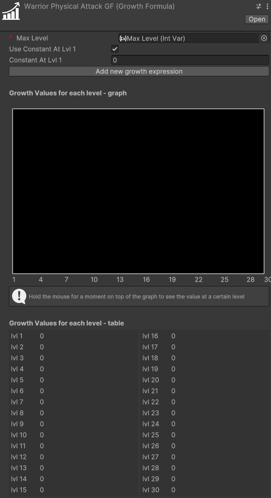
The Max Level, a mandatory field, is set with an `IntVar` assigned by default. We can edit that variable to change the maximum level that will be computed for our growth formula.

> [!WARNING]
> When modifying the value of a variable referenced in growth formulas, such as Max Level, the growth formulas are not directly updated unless you select them in the inspector. To update all growth formulas simultaneously after changing the maximum level, a command is available in the menu: `Tools > SOAP RPG Framework > Validate All Growth Formulas`.  
> Validation occurs automatically during script compilation, upon entering play mode, and when instantiating a prefab. This is achieved through the `OnValidate` callback, which ensures that formulas are updated accordingly.

The `Use constant value at level 1` checkbox lets us decide whether to use a constant value at level 1 or not. If checked, the `Constant Value` field will be enabled, and we can set a value for it. In this case, we set it to 10.

The `Add new growth expression` button lets us add a growth expression for a certain range of levels of our choice. If we press it, we will see the following:  
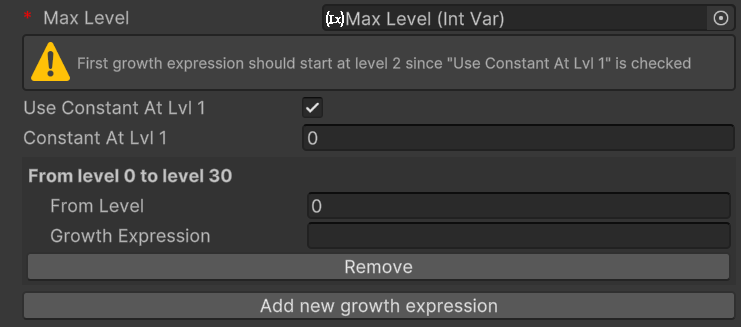

The new section includes two fields: `From Level` and `Growth Expression`. 

- **From Level**: Specifies the starting level at which the corresponding `Growth Expression` becomes effective.  
- **Growth Expression**: Defines how the value evolves starting from the specified level.  

If the `Growth Expression` overlaps with the `Constant At Lvl 1` option, a warning will appear. To resolve this, set the `From Level` field to `2` or higher, and the warning will disappear.

We want to model the Physical Attack of a warrior as follows:
- Level 1: 10
- From level 2 to level 5: +2 per level
- At level 11: flat +30 (like a bonus due to other game mechanics, such as an awakening)
- From level 12 and onward: grows by 7% each level

To achieve this, set the `Constant At Lvl 1` field to `10`. For the first growth expression, use `PRV + 2` as the formula. `PRV`, as we saw before, represents the value of the growth formula at the previous level (in this case, `10` at level 1).

This formula ensures that the value grows by `2` times the level at each subsequent level.

Next we want to press the `Add new growth expression` button to add the next growth expression for the levels. 
For the second growth expression, set `From Level` to `11` and use the formula `PRV + 30`. This ensures that at level 11, a flat bonus of 30 is added to the previous value.  

Finally, for the third growth expression, set `From Level` to `12` and use the formula `PRV * 1.07`. This ensures that from level 12 onward, the value increases by 7% each level.  

After adding these growth expressions, the `GrowthFormula` for the `Warrior Physical Attack GF` should look like this:  
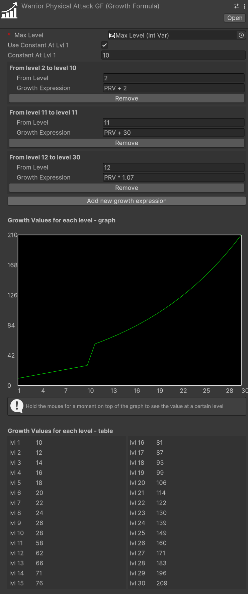  

With this setup, the `GrowthFormula` will correctly calculate the Physical Attack values for the warrior class based on the specified rules.

#### Interactive Chart
If you hold your mouse for a moment onto the chart, a label will show up, showing the exact value of the growth formula at the pointed level:  
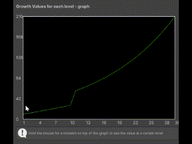

## Make a `GameObject` an entity
To make a `GameObject` an entity, we need to add the `MonoBehaviour` `EntityCore` to it. Select your object from the hierarchy and click, in the inspector, on "Add component". Then search for and select `EntityCore`.  
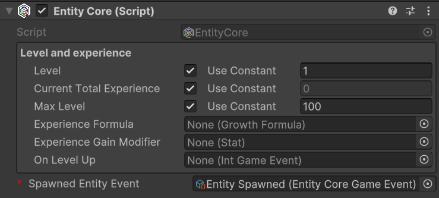  

From the inspector, we can configure several values. Let's analyze them one by one.

`Level`: defines the entity's level. By changing its value, we can assign a different level to the entity directly from the inspector. This can be useful for testing purposes.
You'll notice the `Use Constant` checkbox. If checked, you can pass an `IntVar` instead of using a constant.

`Current Total Experience`: Represents the total experience possessed by the entity.
> [!WARNING]  
> If you've passed a `LongRef` for the current total experience, the value contained in this variable should not be modified manually.
> If `Use constant` is checked instead, the value is readonly.  

`Max Level`: The maximum level the entity can reach

`Experience Formula`: `GrowthFormula` that describes how the total experience required to reach the next level grows at each level.

`On Level Up`: `IntGameEvent` that should be raised when the entity levels up.

`Spawned Entity Event`: `EntityCoreGameEvent` that should be raised when this entity's `Start()` method is executed.

You may notice that a game event is already assigned to `Spawned Entity Event`. This is because an instance of that game event has been explicitly assigned directly in the inspector of the `EntityCore` script. This choice was made since in most cases the same event instance will always be used for entity spawning. This means you don't have to reassign this event every time you create a new entity in Unity. As we'll see later, this default assignment mechanism has been used for other components as well.

## Creating Simple RPG Core assets
All the instances of the various assets that derive from `ScriptableObject`s can be created in the following ways:
- Context menu: `Right click on the hierarchy > Create > Simple RPG Core`
- Top bar: `Assets > Create > Simple RPG Core`
- Hotkeys: By pressing the respective keyboard shortcut while a folder or an element of the hierarchy is currently selected

> [!NOTE]  
> For Mac users the `Ctrl` key corresponds to the `Cmd` key. 

## Create attributes
*Keyboard shortcut:* `Ctrl + Alt + A`  
*Relative path:* `Attribute`

Once created a new attribute you can name it as you wish and you'll be able tweak some settings in the inspector.
For example lets create a `Strength` attribute. Create an `Attributes` folder in your hierarchy, then press `A` and name the newly created attribute `Strength`.  
In the inspector it should look like:  
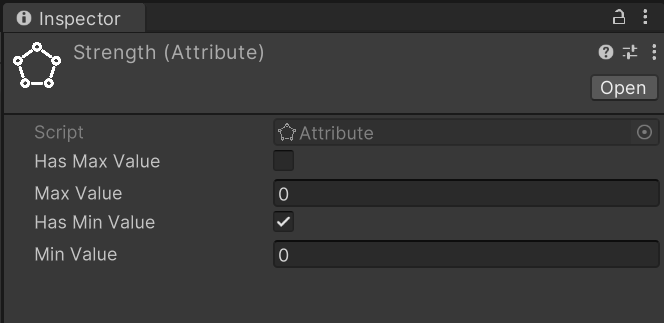

By checking `Has Max Value`, we will set a maximum value for the attribute. By default, there is no maximum value.

By checking `Has Min Value`, we will set a minimum value for the attribute. By default, the minimum value is zero.

Repeat the process for also the `Constitution`, `Intelligence`, and `Dexterity` attributes.

##  Create an attribute set 
*Relative path:* `Attribute Set`

Now that we have some attributes let's create an `AttributeSet` named, for example, `Hero Attribute Set`. In the inspector it should look like this:  
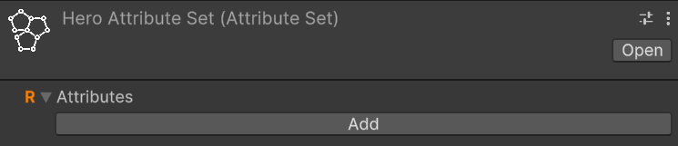

An attribute set without attributes isn't very useful, so let's add the previously created ones, one at a time. To do this, click on the `Add` button. Notice that an entry with `None (Attribute)` appears:  
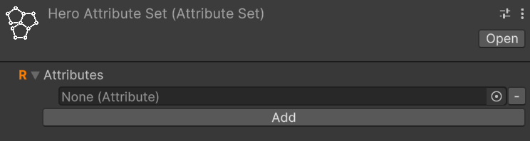  

To assign an attribute to the entry, we can either drag & drop from the hierarchy or click on the small circle button on the right of the newly appeared entry. This mechanism is the same used for public variables or, more generally, for fields annotated with `SerializeField`, so it will be familiar to you.  
Let's add `Strength` using whichever method you prefer.
Repeat the process of adding an attribute to the set for `Constitution`, `Intelligence`, and `Dexterity` as well.

If you want to remove an attribute from the set, you can click on the small `-` button on the right of the attribute you want to remove.

## Add `EntityAttributes` to an entity
The next step is to assign the attribute set we created to an entity. To do this, let's add the `EntityAttributes` component to our game object. The inspector will look like this:  
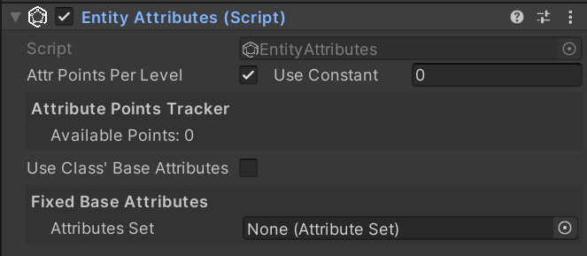

An entity has base points for attributes, which can be either fixed or derived from a class, a configurable amount of attribute points that can be arbitrarily assigned, and these points are granted at each level-up, along with flat and percentage modifiers for the attributes.
Except for the modifiers, which can only be assigned via code, all other values can be configured from the inspector.

`Attr Points Per Level` defines how many arbitrarily spendable attribute points are provided at each level-up. They are assigned starting from level 2 on.

`Attribute Points Tracker` allows monitoring and assigning spendable points. `Available Points` defines how many unspent points are still available.  
If you change the level of the entity you'll see that available points change accordingly. And as you spend them, `Available Points` will decrease.
  
Moreover, there is a checkbox labeled `Use Class Base Attributes`. For now, let's leave it unchecked since we haven't added a class yet. However, in this case, we need to manually assign an attribute set. Therefore, let's set the `Attribute Set` field found under `Fixed Base Attributes` with the `Hero Attribute Set`. By doing this, we now have access to additional fields in the inspector:  
  
We can assign values to the attributes of `Fixed Base Attributes` as we see fit.

### Adding Modifiers

While base attributes are set in the inspector, modifiers can be added through code using these methods:

```csharp
// Add flat bonus
entityAttributes.AddFlatModifier(attribute, value); // Adds fixed amount

// Add percentage bonus
entityAttributes.AddPercentageModifier(attribute, percentage);
```

The modifiers are applied in this order:
1. Base value
2. Spent attribute points
3. Flat modifiers
4. Percentage modifiers

For example, with:
- Base Strength: 10
- 2 spent points
- Flat modifier: +3
- 40% Strength increase

The final calculation would be:
1. Base (10) + Spent (+2) = 12
2. 12 + (Flat) + 3 = 15
3. 15 + (15 * 0.4) = 21

When adding modifiers through code, the attribute cache will automatically be invalidated to ensure the correct value is returned on the next access.

## Create stats
*Keyboard shortcut:* `Ctrl + Alt + S`  
*Relative path:* `Stat`

As with attributes, you can create stats as you wish and assign them the names you prefer.
Let's create the `Physical Attack` stat together.
Create a new `Stats` folder, select it and press `S`. Name it `Physical Attack`. In the inspector, it should look like this:
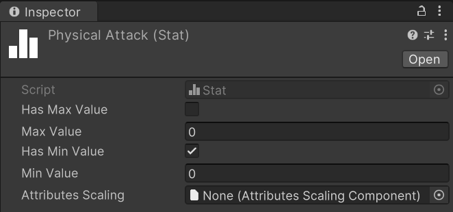

As with attributes, you can assign both a maximum and a minimum value to a stat.

Repeat the process for the `Magical Power`, `Defense`, and `Critical Chance` stats.

Unlike attributes, however, stats include `Attributes Scaling`.

### Create an Attribute Scaling Component for Stats 
*Relative path:* `Scaling -> Attribute Scaling Component`

Let's create a new `Attribute Scaling Component` to use with the strength stat we created earlier.
Create a new folder named, for example, `Attribute Scalings for Stats`, and inside it, create an attribute scaling component called `Physical Attack Strength Scaling`.

Assign the previously created `Hero Attribute Set` to the `Set` field. You will see the attributes of the set appear. Here, you can assign scaling values using `double`. For example, set the scaling of `Strength` to `1.0`. This component defines a 100% scaling on the value of `Strength`.

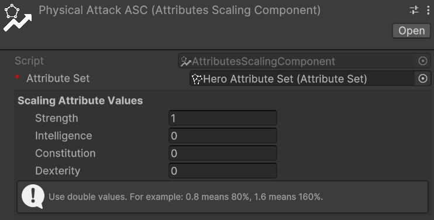

Now, assign this scaling component to the `Physical Attack` stat to ensure it scales with the `Strength` attribute.

## Create a stat set  
*Relative path:* `Stat Set`

Now that we have some stats, let's create a `StatSet` named, for example, `Hero Stat Set`.

A stat set without stats isn't very useful, so let's add the previously created ones, one at a time. To do this, click on the `Add` button. Notice that an entry with `None (Stat)` appears. To assign a stat to the entry, we can either drag & drop from the hierarchy or click on the small circle button on the right of the newly appeared entry. This mechanism is the same used for public variables or, more generally, for fields annotated with `SerializeField`, so it will be familiar to you.  
Let's add `Physical Attack` using whichever method you prefer.  
Repeat the process of adding a stat to the set for `Magical Power`, `Defense`, and `Critical Chance` as well. The stat set should look like:  
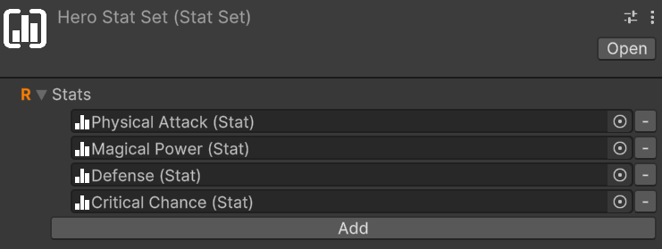

If you want to remove a stat from the set, you can click on the small `-` button on the right of the stat you want to remove.

## Add `EntityStats` to an Entity
The next step is to assign the stat set we created to an entity. To do this, let's add the `EntityStats` component to our game object. The inspector will look like this:  
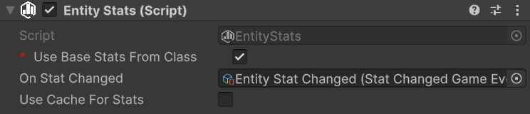

An entity has base stats that can be either fixed or derived from a class. Additionally, stats can be modified through flat modifiers, stat-to-stat modifiers, and percentage modifiers.

`Use Class Base Stats` checkbox determines whether the base stats should come from the entity's class (if one is available) or from fixed values defined in the inspector. For now, let's leave it unchecked since we haven't added a class yet.

With `Use Class Base Stats` unchecked, we need to manually assign a stat set. Set the `Stat Set` field under `Fixed Base Stats` with our `Hero Stat Set`. This will reveal additional fields in the inspector where we can set the base values for each stat:
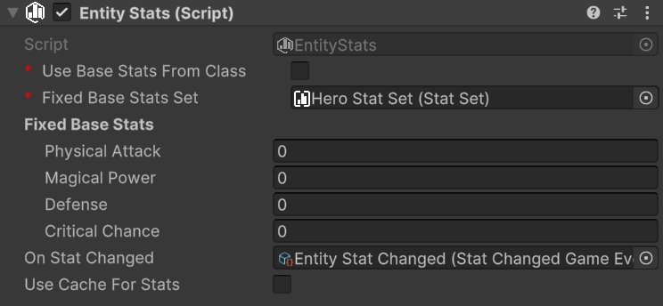  

`On Stat Changed` event gets raised whenever any stat value changes due to modifiers. You can use this to update UI elements or trigger other game logic.

`Use Cache` enables caching of final stat values. This is useful for performance when you have many entities or complex stat calculations.

### Adding Modifiers

While base stats are set in the inspector, modifiers can be added through code using these methods:

```csharp
// Add flat bonus
entityStats.AddFlatModifier(stat, value); // Adds fixed amount

// Add stat-to-stat scaling
entityStats.AddStatToStatModifer(targetStat, sourceStat, percentage); 

// Add percentage bonus
entityStats.AddPercentageModifier(stat, percentage);
```

The modifiers are applied in this order:
1. Base value
2. Flat modifiers
3. Stat-to-stat modifiers  
4. Percentage modifiers

For example, with:
- Base Physical Attack: 100
- Flat modifier: +20
- 50% of Strength (value 40) as Physical Attack
- 25% Physical Attack increase

The final calculation would be:
1. Base (100) + Flat (+20) = 120
2. 120 + (40 * 0.5) = 140
3. 140 + (140 * 0.25) = 175

When adding modifiers through code, the `OnStatChanged` event will automatically be raised if the final value changes.

## Create a class
*Relative path:* `Class`

Let's create an instance of `Class` called `Warrior`. It should appear like this:

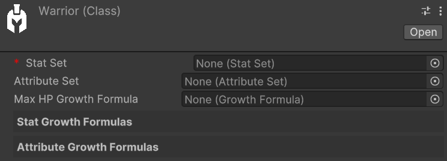

The only mandatory field is `Stat Set`. If we don't make use of attributes and Max HP, we can leave the `Attribute Set` and `Max HP Growth Formula` fields empty.

In our case, let's assign our `Hero Stat Set` to `Stat Set` and `Hero Attribute Set` to `Attribute Set`. This way, the `Warrior` will have access to all stats and attributes from the assigned `Stat Set` and `Attribute Set`.
As we fill these two fields, we'll see that the `Stat Growth Formulas` and `Attribute Growth Formulas` sections will automatically populate with the stats and attributes from the assigned `Stat Set` and `Attribute Set`.
Let's proceed to create all the growth formulas for the warrior's stats and attributes.
Follow the steps outlined in the [Growth Formulas](#growth-formulas) section to create the growth formulas for the warrior's stats and attributes.  
Once all growth formulas are assigned, the `Warrior` should look like this:
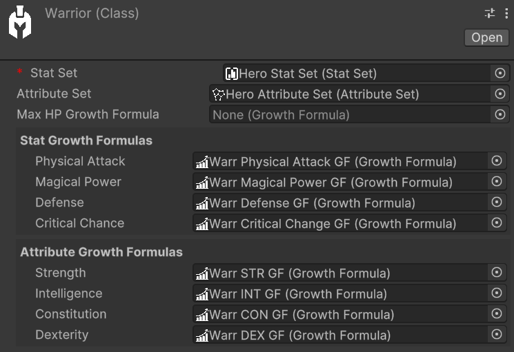

`Max HP Growth Formula` allows specifying how the Max HP value grows as levels change. In our example, we'll leave it empty.
The presence of this field for hit points might be surprising since this module of the framework isn't focused on health management. Indeed, damage and health are managed by the *Health&Dmg | Soap RPG Framework* module, which will be released in the coming months.
However, this field is positioned here since the scaling of base max hp still depends on the class.

## Add `EntityClass` to an entity
To assign a class to an entity, we need to add the `EntityClass` component to it. The inspector will look like this:

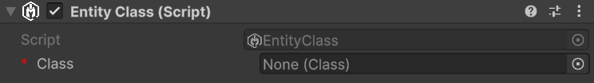 

All we have to do now is just assign the `Warrior` class we created earlier to the `Class` field.

### Switching to class-based attributes and stats
We can now check the `Use Class Base Attributes` and `Use Class Base Stats` checkboxes. By doing this, the entity will use the base attributes and stats defined by the class. The `Fixed Base Attributes` and `Fixed Base Stats` fields will be disabled, and the values will be automatically retrieved from the class growth formulas.

## Create Scaling Formulas
*Keyboard shortcut:* `Alt + Shift + S`
*Relative path:* `Scaling -> Scaling Formula`

We already saw how to create an `Attribute Scaling Component` for stats. On top of such usage, scaling components, and more in general scaling formulas, can be used for much more situations. For example, they can be used to define the damage of an ability, to define the bonus granted by a piece of equipment, or to define the damage of a weapon. In general, they can be used to define any kind of scaling that can be expressed as a function of one or more variables.

For example, let's create a `Scaling Formula` called `Mighty Blow SF`. It should look like this in the inspector:

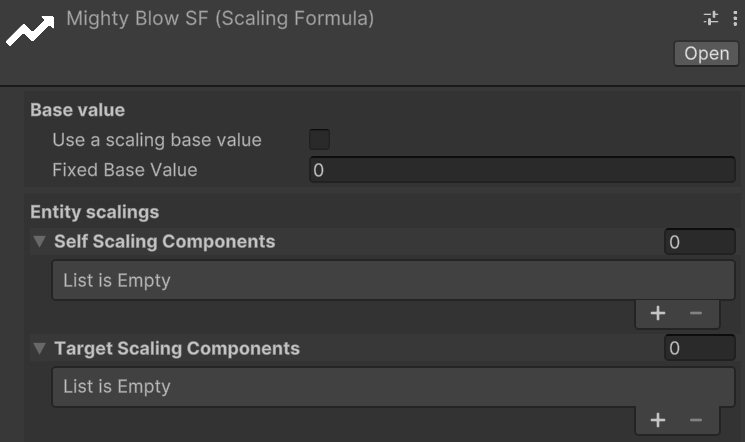
`Base Value` determines the starting point for the scaling formula. It can either be a fixed constant value or a value that scales with levels (e.g., the level of the Mighty Blow skill). If the latter is chosen, a `Growth Formula` must be provided to define how the base value changes as levels increase.

This scaling formula will be used to define the damage of a skill called `Mighty Blow`.
The scaling formula will be defined as follows:
- Base damage: 10 at lvl 1, 25 at level 2, 60 at lvl 3
- Damage scaling: 1.5 * Physical Attack + 0.5 * Constitution

Since we want a base value that varies as level grows, let's check the `Use a scaling base value` checkbox and create a `Growth Formula` named `Mighty Blow Base Dmg GF`. The `Mighty Blow Base Damage GF` should look like this:

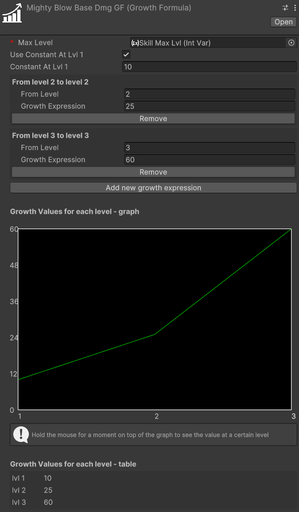

Notice that a new Skill Max Lvl has been created and assigned to `Max Level`. This is necessary as the skill max level is not related to the max level of our hero.

We can now assign this growth formula to the `Base Value` field of the `Mighty Blow SF` scaling formula.

Under `Entity Scalings` we have `Self Scaling Components` and `Target Scaling Components`. The former are used to define the scaling of the entity itself, while the latter are used to define the scaling of the target of the ability. In our case, we will only use `Self Scaling Components`, so we can leave `Target Scaling Components` empty.

We can now proceed to create the scaling components for the `Physical Attack` stat and the `Constitution` attribute.

Let's create a new `Stat Scaling Component` called `Mighty Blow Physical Attack Scaling`. Assign the `Hero Stat Set` to it and set the scaling of the `Physical Attack` stat to `1.5`. The scaling component should look like this:

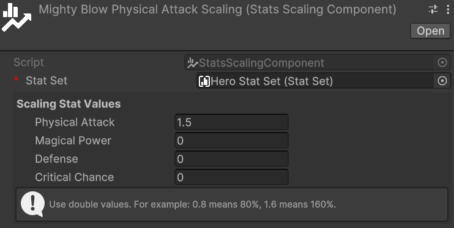  

Next, we will create a similar `Attribute Scaling Component` for the `Constitution` attribute called `Mighty Blow Constitution Scaling`. Assign the `Hero Attribute Set` to it and set the scaling of the `Constitution` to `0.5`. The scaling component should look like this:

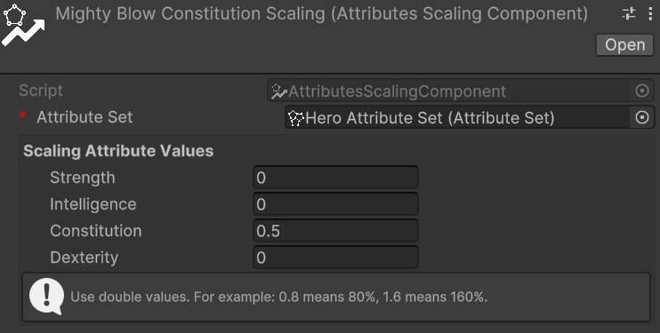

Finally, let's press on the `+` of `Self Scaling Components` and assign the two scaling components we just created. The `Mighty Blow SF` should look like this:

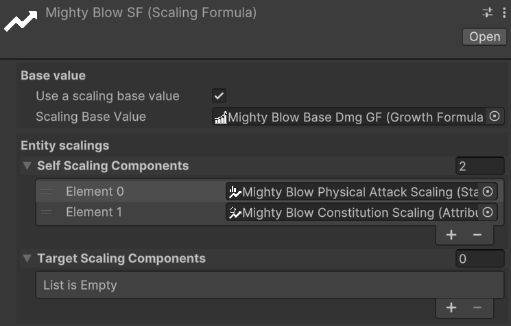
