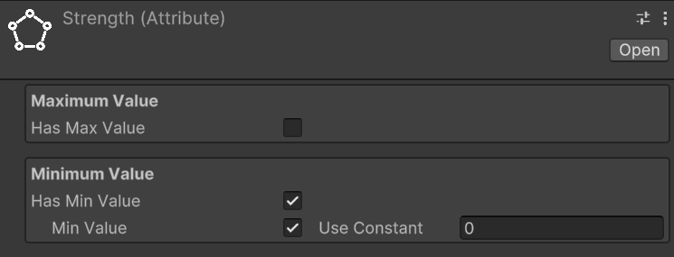

# Workflows
<!--
======UTILITIES
- Game Events as SOs
- Int and Long Vars
- Int and Long Refs
- Growth Formulas

======ENTITY
- Make a GameObject an entity
- EntityLevel

======ATTRIBUTES
- Create some Attributes
- Create an AttributeSet
    - Assign Attributes to an AttributeSet
- Add EntityAttributes to an entity

======STATS
- Create some Stats
    - Create AttributeScalingComponent for Stats
- Create a StatSet
    - Assign Stats to a StatSet
- Add EntityStats to an entity

======CLASS
- Create a class
- Add EntityClass to an entity
- Use class based entity attributes and stats

======SCALING FORMULA
- ScalingFormulas
- StatsScalingComponent
- AttributesScalingComponent
-->

## Some utilities
Almost every class provided by this package uses events or variables in the form of `ScriptableObject`. Therefore, let's quickly introduce these concepts so that we are clear about what we are talking about when we encounter them in the following paragraphs.

### Game events as `ScriptableObjects`
The SOAP architecture allows us to implement the Observer pattern through scriptable objects. In the simplest case, with events without context, we can define various game events as `GameEvent` instances: a class that derives from `ScriptableObject`. For example, we can create an instance called `PlayerJumped` that represents the event "The player has jumped". This event will notify all listening systems when it occurs.
Systems subscribe to this event using the `MonoBehaviour` `GameEventListener`. We can assign a `GameEvent` to this component, and it will handle the subscription and invoke a callback when the event is triggered. The callback is a [UnityEvent](https://docs.unity3d.com/ScriptReference/Events.UnityEvent.html), so we can select a callback to invoke in response to our event directly from the inspector.

For more details, see the [Game Events section](#game-events).

### Int and Long Vars
Another common use of `ScriptableObject` in the SOAP architecture is to define variables. The main advantage of these variables in the form of SO is that they can be easily shared between various objects that may decide to share the same value. A common example is the player's game score. There could be a game manager that adds or removes points from this variable, while the UI HUD uses it to display its value on the screen. This way, we can keep the game manager and UI completely decoupled, passing shared values (like variables) through the inspector.

### Int and Long Refs
`IntRef` and `LongRef` allow choosing whether to use a native value (`int` or `long`) or an `IntVar`/`LongVar`. As mentioned in the previous paragraph, `IntVar` and `LongVar` have the advantage of being shareable between different components/game objects, while native values are more immediate to use and require less setup (no need to instantiate an `IntVar`/`LongVar` and assign it in the inspector).

## Make a `GameObject` an entity
To make a `GameObject` an entity, we need to add the `MonoBehaviour` `EntityCore` to it. Select your object from the hierarchy and click, in the inspector, on "Add component". Then search for and select `EntityCore`.

(TODO) Add image of the entity core

From the inspector, we can configure a series of values. Let's analyze them one by one.

`Level`: defines the level of the entity. By changing its value, we can assign a different level to the entity directly from the inspector. This can be useful for testing purposes.
You will notice the `Use Constant` checkbox. If checked, you can pass an `IntVar` instead of using a constant.
`Current Total Experience`: Represents the total experience possessed by the entity. This value cannot be modified.

### Growth Formulas
As already mentioned in [Introduction](introduction.md), `GrowthFormula` allows defining how a certain value varies as levels increase. A `GrowthFormula` can be instantiated through the hierarchy context menu by going to `Simple RPG Core -> Growth Formula`.
The package provides a custom property drawer for `GrowthFormula`.

For more details, see the [Growth Formulas section](#growth-formulas).

## Make a `GameObject` an entity
To make a `GameObject` an entity, we need to add the `MonoBehaviour` `EntityCore` to it. Select your object from the hierarchy and click, in the inspector, on "Add component". Then search for and select `EntityCore`.

(TODO) Add image of the entity core

From the inspector, we can configure a series of values. Let's analyze them one by one.

`Level`: defines the level of the entity. By changing its value, we can assign a different level to the entity directly from the inspector. This can be useful for testing purposes.
You will notice the `Use Constant` checkbox. If checked, you can pass an `IntVar` instead of using a constant.  
`Current Total Experience`: Represents the total experience possessed by the entity. Being this a `LongRef`, you can choose whether to use a const value (a native `long`), or a `LongVar` instead.

### Game events
The package also supports game events with up to 4 context parameters. They are generics, but in Unity, it is not possible to instantiate classes that derive from ScriptableObject if they are generics with unspecified type parameters. To use them, we must explicitly declare classes that derive from the generic GameEvent and fix the type parameters with concrete types. To simplify the definition of new event types, with specific types as context parameters, the package provides `GameEventGenerator`. These generators, which derive from SO, allow generating the concrete classes of `GameEvent`.
We will see these generators in more detail in the section (TODO).
Some game events are already defined and made available by the package (see the [Samples](samples.md) page).

### Int and Long Vars

### Int and Long Refs
`IntRef` and `LongRef` allow choosing whether to use a native value (`int` or `long`) or an `IntVar`/`LongVar`. As mentioned in the previous paragraph, `IntVar` and `LongVar` have the advantage of being shareable between different components/game objects, while native values are more immediate to use and require less setup (no need to instantiate an `IntVar`/`LongVar` and assign it in the inspector).

Thanks to a custom property drawer, it will be possible, from the inspector, to check a checkbox named `Use constant` to use a native value instead of a `Ref`, and vice versa.

`IntRef` and `LongRef` are widely used in the package's `MonoBehaviour`.

### Growth Formulas
As already mentioned in [Introduction](introduction.md), `GrowthFormula` allows defining how a certain value varies as levels increase. A `GrowthFormula` can be instantiated through the hierarchy context menu by going to `Simple RPG Core -> Growth Formula`.
The package provides a custom property drawer for `GrowthFormula`.

#### Max level for the values
In the inspector of a `GrowthFormula`, we can pass an `IntVar` to define up to which level to grow the values.

#### Use constant at level one
If the checkbox named `Use constant value at level 1` is checked, the respective constant value will be used.

#### Growth equations
The various values of the `GrowthFormula` are defined by a function where values, the y-axis, are expressed in function of the levels, the x-axis. Such function is defined as a system of equations. Each equation is a string that associates a math expression to a range of levels.
The string can be defined by using the [Unity ExpressionEvaluator](https://docs.unity3d.com/6000.0/Documentation/ScriptReference/ExpressionEvaluator.html) syntax. On top of it, the following terms can be used:
- `LVL`: the level at each iteration
- `PRV`: the previous value of the `GrowthFormula` (value evaluated at the previous level)
- `SPRV`: the second previous value of the `GrowthFormula` (value evaluated 2 levels ago)
- `SUM`: the sum of the values of the `GrowthFormula` from level 1 up to the previous level

## Make a `GameObject` an entity
To make a `GameObject` an entity, we need to add the `MonoBehaviour` `EntityCore` to it. Select your object from the hierarchy and click, in the inspector, on "Add component". Then search for and select `EntityCore`.
  
*Image - Entity Core Custom Editor*

From the inspector, we can configure several values. Let's analyze them one by one.

`Level`: defines the entity's level. By changing its value, we can assign a different level to the entity directly from the inspector. This can be useful for testing purposes.
You'll notice the `Use Constant` checkbox. If checked, you can pass an `IntVar` instead of using a constant.

`Current Total Experience`: Represents the total experience possessed by the entity.
> [!WARNING]  
> If you've passed a `LongRef` for the current total experience, the value contained in this variable should not be modified manually.
> If `Use constant` is checked instead, the value is readonly.  

`Max Level`: The maximum level the entity can reach

`Experience Formula`: `GrowthFormula` that describes how the total experience required to reach the next level grows at each level.

`On Level Up`: `IntGameEvent` that should be raised when the entity levels up.

`Spawned Entity Event`: `EntityCoreGameEvent` that should be raised when this entity's `Start()` method is executed.

You may notice that a game event is already assigned to `Spawned Entity Event`. This is because an instance of that game event has been explicitly assigned directly in the inspector of the `EntityCore` script. This choice was made since in most cases the same event instance will always be used for entity spawning. This means you don't have to reassign this event every time you create a new entity in Unity. As we'll see later, this default assignment mechanism has been used for other components as well.

## Creating Simple RPG Core assets
All the instances of the various assets that derive from `ScriptableObject`s can be created in the following ways:
- Context menu: `Right click on the hierarchy > Create > Simple RPG Core`
- Top bar: `Assets > Create > Simple RPG Core`
- Hotkeys: By pressing the respective keyboard shortcut while a folder or an element of the hierarchy is currently selected

> [!NOTE]  
> For Mac users the `Ctrl` key corresponds to the `Cmd` key. 

## Create attributes
*Keyboard shortcut:* `A`  
*Relative path:* `Attribute`

Once created a new attribute you can name it as you wish and you'll be able tweak some settings in the inspector.
For example lets create a `Strength` attribute. Create an `Attributes` folder in your hierarchy, then press `A` and name the newly created attribute `Strength`.  
In the inspector it should look like:  

By checking `Has Max Value`, we will set a maximum value for the attribute. By default, there is no maximum value.

By checking `Has Min Value`, we will set a minimum value for the attribute. By default, the minimum value is zero.

Repeat the process for also the `Constitution`, `Intelligence`, and `Dexterity` attributes.

##  Create an attribute set
*Keyboard shortcut:* `Alt + A`  
*Relative path:* `Attribute Set`

Now that we have some attributes let's create an `AttributeSet` named, for example, `Hero Attribute Set`. In the inspector it should look like this:  

An attribute set without attributes isn't very useful, so let's add the previously created ones, one at a time. To do this, click on the `Add` button. Notice that an entry with `None (Attribute)` appears:  
  

To assign an attribute to the entry, we can either drag&drop from the hierarchy or click on the small circle button on the right of the newly appeared entry. This mechanism is the same used for public variables or, more generally, for fields annotated with `SerializeField`, so it will be familiar to you.  
Let's add `Strength` using whichever method you prefer.
Repeat the process of adding an attribute to the set for `Constitution`, `Intelligence`, and `Dexterity` as well.

If you want to remove an attribute from the set, you can click on the small `-` button on the right of the attribute you want to remove.

## Add `EntityAttributes` to an entity
The next step is to assign the attribute set we created to an entity. To do this, let's add the `EntityAttributes` component to our game object. The inspector will look like this:  

An entity has base points for attributes, which can be either fixed or derived from a class, a configurable amount of attribute points that can be arbitrarily assigned, and these points are granted at each level-up, along with flat and percentage modifiers for the attributes.
Except for the modifiers, which can only be assigned via code, all other values can be configured from the inspector.

`Attr Points Per Level` defines how many arbitrarily spendable attribute points are provided at each level-up. They are assigned starting from level 2 on.

`Attribute Points Tracker` allows monitoring and assigning spendable points. `Available Points` defines how many unspent points are still available.  
If you change the level of the entity you'll see that available points change accordingly. And as you spend them, `Available Points` will decrease.
  
Moreover, there is a checkbox labeled `Use Class Base Attributes`. For now, let's leave it unchecked since we haven't added a class yet. However, in this case, we need to manually assign an attribute set. Therefore, let's set the `Attribute Set` field found under `Fixed Base Attributes` with the `Hero Attribute Set`. By doing this, we now have access to additional fields in the inspector:  
  
We can assign values to the attributes of `Fixed Base Attributes` as we see fit.

## Create stats
*Keyboard shortcut:* `S`  
*Relative path:* `Stat`

As with attributes, you can create stats as you wish and assign them the names you prefer.
Let's create the `Physical Attack` stat together.
Create a new `Stats` folder, select it and press `S`. Name it `Physical Attack`. In the inspector, it should look like this:

As with attributes, you can assign both a maximum and a minimum value to a stat.

Repeat the process for the `Magical Power`, `Physical Defense`, and `Critical Chance` stats.

Unlike attributes, however, stats include `Attributes Scaling`.

### Create an Attribute Scaling Component for Stats
*Keyboard shortcut:* `Ctrl + Alt + A`  
*Relative path:* `Scaling -> Attribute Scaling Component`

Let's create a new `Attribute Scaling Component` to use with the strength stat we created earlier.
Create a new folder named, for example, `Attribute Scalings for Stats`, and inside it, create an attribute scaling component called `Physical Attack Strength Scaling`.

Assign the previously created `Hero Attribute Set` to the `Set` field. You will see the attributes of the set appear. Here, you can assign scaling values using `double`. For example, set the scaling of `Strength` to `1.0`. This component defines a 100% scaling on the value of `Strength`.

Now, assign this scaling component to the `Physical Attack` stat to ensure it scales with the `Strength` attribute.

## Create a StatSet

