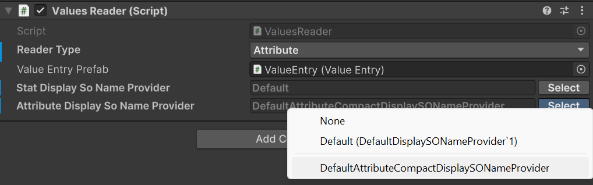
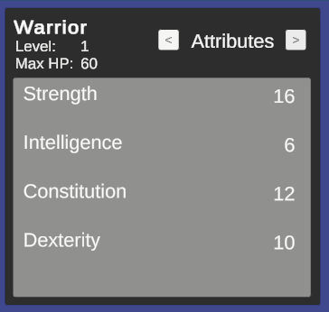
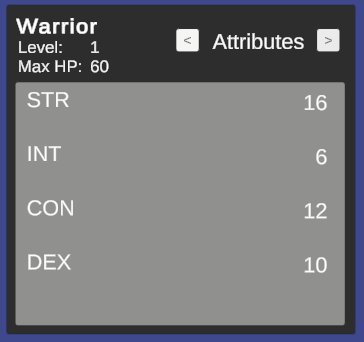

# Advanced topics

## Presentation layer and localization
*🏷️ Version 1.2.0+*

The framework focuses on the business logic of game systems and does not impose any specific presentation layer or localization strategy. You are free to implement your own UI and localization solutions that best fit your project's needs.
However, the framework provides basic support for the presentation layer by allowing you to define display names for attributes, statistics, and classes. These display names can be used in your UI to present information to players in a user-friendly manner.
In fact, ScriptableObjects names are convenient and quick to use during development, but they are not ideal for presentation to players. By defining display names, you can separate the internal representation of your game systems from the user-facing presentation layer.

### `IDisplaySONameProvider`

The framework includes the `IDisplaySONameProvider` interface, which can be implemented by UI components to display readable names for attributes, statistics, and classes:  
```csharp
public interface IDisplaySONameProvider
{
    string GetDisplayName(ScriptableObject asset);
}
```

The framework provides a default implementation of this interface, `DefaultDisplaySONameProvider`, which retrieves the ScriptableObject's name and returns it as the display name. You can use this default implementation or create your own custom implementation to suit your localization needs.

The attributes are a particular case, as in many RPGs they can either be presented with the extended name (e.g., "Strength") or with an abbreviation (e.g., "STR"). To accommodate this, the framework provides the `DefaultAttributeCompactDisplaySONameProvider` implementation, which returns the first three letters, capitalized, as the display name for a certain attribute.

### Using custom display name providers

To use a custom display name provider, you can instantiate your implementation in your own scripts, or rely on the `TypeSelectable` attribute provided by the framework to select the implementation from the Unity inspector. For example:  
```csharp
[SerializeReference, TypeSelectable(typeof(DefaultDisplaySONameProvider))]
private IDisplaySONameProvider _attributeDisplayNameProvider;
```
`TypeSelectable` is an experimental feature of the framework that allows you to select a concrete implementation of an interface from the Unity inspector.  
The parameter passed to `TypeSelectable` is the default implementation that will be selected when the inspector is first displayed. You can then choose a different implementation from a dropdown list in the inspector.

> [!NOTE]
> Starting with v2.0.0, the editor emits a startup warning (`TypeSelectableClosedGenericValidator`) when a `[SerializeReference, TypeSelectable]` field targets a closed generic type. This is a guardrail against [Unity bug UUM-44729](https://issuetracker.unity3d.com/issues/movedfrom-attribute-is-not-working-for-generic-types), where renaming any type inside a generic argument silently drops the serialized value. If you see this warning, refactor the field type to the non-generic `IDisplaySONameProvider`.

If you take a look at the demo scene, if you select the `AttributesContainer` GameObject inside `WarriorCanvas -> HeroPanel` in the hierarchy, you will see a `Attribute Display So Name Provider` field in the inspector under the `Values Reader` component. This field uses the `TypeSelectable` attribute to allow you to choose between the default and compact display name providers for attributes.  


The implementation passed as parameter to `TypeSelectable` will be instantiated automatically by the framework during script compilation. Moreover, the framework will show it in the inspector, in the dropdown list, as the Default option under `None`.

During Play Mode, you can switch between the different implementations to see how the display names change in the UI of the sample scene.
With the default implementation, the attributes will be displayed with their full names:  


With the compact implementation, the attributes will be displayed with their abbreviations:  


## Reader APIs and safe value access
*🏷️ Version 2.0.0+*

When you only need to read values, prefer the dedicated reader interfaces over reaching into concrete components. `IAttributeReader` and `IStatReader` expose safe `TryGet` / `TryGetBase` APIs that let you query both final and pre-modifier values without assuming the requested asset is present.

```csharp
IAttributeReader attributeReader = entityCore;
IStatReader statReader = entityCore;

if (attributeReader.TryGet(strengthAttribute, out long strength) &&
    statReader.TryGet(physicalAttackStat, out long physicalAttack))
{
    Debug.Log($"STR {strength}, PATK {physicalAttack}");
}
```

`EntityCore` implements both reader interfaces, which makes it a convenient read facade for gameplay systems that already work with the entity as their entry point.

If you also need the unmodified values, use `TryGetBase`:

```csharp
if (statReader.TryGetBase(physicalAttackStat, out long basePhysicalAttack))
{
    Debug.Log($"Base Physical Attack: {basePhysicalAttack}");
}
```

`Get` and `GetBase` can still be convenient on concrete containers when you already know the asset exists, but `TryGet` and `TryGetBase` are the safer default for reusable code paths. This is especially relevant in v2.0.0 because `StatSetInstance` is no longer an `IStatReader`; code that needs a generic stat reader should depend on `EntityCore`, `EntityStats`, or another explicit `IStatReader` provider instead.

## Resolving ownership in custom systems
*🏷️ Version 2.2.0+*

`Owner` (see [Entity Ownership](workflows.md#entity-ownership)) tells you which entity ultimately owns another, but different systems often need to resolve "the responsible entity" differently. Take the spaceship example from that section: a lifesteal system built on top of the framework needs to know that the *ship* should be healed when its weapon lands a killing blow, even though the weapon is the one recorded as `Performer`.

`EntityAttribution` and `EntityOwnership.Resolve` exist for exactly this kind of decision:

```csharp
public enum EntityAttribution { Direct, Owner, Root }

public static class EntityOwnership
{
    public static EntityCore Resolve(EntityCore entity, EntityAttribution attribution);
}
```

- `Direct`: returns `entity` unchanged. This preserves the framework's behavior from before ownership existed, and should stay the default for any new field or setting that exposes `EntityAttribution`.
- `Owner`: returns `entity.Owner`, or `entity` itself if it has no owner.
- `Root`: returns `entity.Root`, walking the full ownership chain.

```csharp
EntityCore beneficiary = EntityOwnership.Resolve(damagePerformer, EntityAttribution.Root);
if (beneficiary == thisEntity)
{
    // Apply lifesteal to thisEntity, credited through the weapon's owner chain.
}
```

Expose `EntityAttribution` as a serialized field on your own config or component when you want project code (or another package built on top of the framework, such as Astra RPG Health's lifesteal and kill-credit resolution) to choose how attribution should behave, rather than hardcoding one resolution strategy.

## Pluggable fixed base value sources
*🏷️ Version 2.1.0+*

Fixed base attributes and stats no longer have to come from the Inspector alone. `EntityAttributes` and `EntityStats` source their fixed base values through `IFixedAttributeSource` and `IFixedStatSource`, two minimal, point-queried contracts:

```csharp
public interface IFixedAttributeSource : IValueContainer<AttributeSO>
{
    long GetBase(AttributeSO attribute);
}

public interface IFixedStatSource : IValueContainer<StatSO>
{
    long GetBase(StatSO stat);
}
```

The inline values shown in the Inspector and the asset-backed `FixedAttributeValuesSO` / `FixedStatValuesSO` (see [Fixed base attribute sources](workflows.md#fixed-base-attribute-sources) and [Fixed base stat sources](workflows.md#fixed-base-stat-sources)) both implement these interfaces, but you can also supply your own implementation, backed by save data, procedural generation, live-ops config, or any other source.

### Swapping fixed base values at runtime

`SetFixedAttributeSource` (and its `EntityStats` counterpart, `SetFixedStatSource`) replaces every fixed base value from a source in one call:

```csharp
entityAttributes.SetFixedAttributeSource(myCustomSource);

// Or from a plain dictionary (e.g. deserialized save data), without implementing the interface:
entityAttributes.SetFixedAttributeSource(new Dictionary<AttributeSO, long> {
    { strengthAttribute, 14 },
    { constitutionAttribute, 12 },
});
```

The provided source must cover every attribute (or stat) in the entity's current attribute/stat set; an assertion failure is raised otherwise. Only one `OnAttributeChanged` / `OnStatChanged` event is raised per attribute or stat whose final value actually changed, reusing the same bulk-update machinery as level-up/level-down transitions.

> [!WARNING]
> `SetFixedAttributeSource` / `SetFixedStatSource` always write into the inline values, never into an assigned `FixedAttributeValuesAsset` / `FixedStatValuesAsset`. An asset can be shared across multiple entities, so a per-entity runtime override should not leak into it. If `Use Fixed Attribute Values Asset` (or the stat equivalent) is enabled, disable it first — otherwise the injected values are ignored until you do.

### Swapping the attribute/stat set at runtime

`SetFixedAttributeSet(AttributeSetSO)` and `SetFixedStatSet(StatSetSO)` replace the schema used for fixed base values at runtime, reconciling existing values for the attributes/stats shared between the old and new set and defaulting new entries to `0`. Neither raises per-attribute/per-stat change events, matching the framework's existing behavior when a set change is detected elsewhere (from the `AttributeSet` getter, or from `OnValidate`).

Call `SetFixedAttributeSet` / `SetFixedStatSet` and `SetFixedAttributeSource` / `SetFixedStatSource` as two separate, sequential calls rather than combining them: swapping the set first ensures the source you inject afterward is validated against the set that is actually active.

## Rounding double-based calculations
*🏷️ Version 2.0.0+*

The framework now exposes `RoundingMode` to make integer conversion intent explicit when a calculation produces a `double`. The built-in modes are:

- `Round`: rounds to the nearest integer, with midpoint values rounding away from zero
- `Floor`: rounds down
- `Ceil`: rounds up

```csharp
double scaledValue = 214.5;
int rounded = RoundingMode.Round.ApplyToInt(scaledValue); // 215
int floored = RoundingMode.Floor.ApplyToInt(scaledValue); // 214
```

Use `RoundingMode` when authoring custom calculators or other extension points that need deterministic integer conversion semantics instead of ad-hoc casts.

## Owner-aware `GameAction` execution
*🏷️ Version 2.0.0+*

`GameActionBase` is the non-generic root used by inspector-facing authoring surfaces that need to reference actions with different concrete context types. Concrete assets still execute through `GameAction<TContext>`, which now also supports owner-aware execution through `ExecuteWithOwnerAsync`.

This matters most for event-driven workflows. `GameEventListener`s can dispatch owner-aware actions using the listener component as runtime owner, and wrapper actions such as `Composite`, `Delayed`, `Conditional`, and projection actions preserve that owner while forwarding execution. This allows conditions that depend on `Holder` resolution to behave consistently across nested action chains.

For the practical inspector workflow, see [Game Actions](game-actions.md). For the condition-side resolution model, see [Conditions](conditions.md).

## Payload-aware condition fields in custom editors
*🏷️ Version 2.0.0+*

`ConditionFieldWithQuickSetup` is the intended public entry point when a custom inspector pairs a `[SerializeReference]` `IReactiveTrigger` field with a `[SerializeReference]` `Condition` field.

With `filterByTriggerPayload: true`, the helper reads `IReactiveTrigger.PayloadType`, builds a `ConditionEvaluationAvailability`, and reuses the same compatibility rules as the built-in inspectors. In practice, this means:

- condition type pickers only show conditions whose `ConditionPayloadAttribute` metadata is compatible with the current payload
- `ConditionTarget` dropdowns only show entity slots that are actually available in the current evaluation context
- already-authored incompatible trees stay visible and emit inline errors instead of failing silently

> [!NOTE]
> For the metadata contract expected from custom `Condition` and `IReactiveTrigger` types, see [Extending the system with custom conditions and triggers](conditions.md#extending-the-system-with-custom-conditions-and-triggers).

This is the standard inspector-side wiring:

```csharp
using ElectricDrill.AstraRpgFramework.Editor.Conditions;
using UnityEditor;
using UnityEngine;

[CustomEditor(typeof(MyReactiveComponent))]
public sealed class MyReactiveComponentEditor : UnityEditor.Editor
{
    public override void OnInspectorGUI()
    {
        serializedObject.Update();

        var triggerProperty = serializedObject.FindProperty("_trigger");
        var conditionProperty = serializedObject.FindProperty("_condition");

        EditorGUILayout.PropertyField(triggerProperty, true);
        ConditionFieldWithQuickSetup.DrawLayout(
            conditionProperty,
            new GUIContent("Condition"),
            triggerProperty,
            filterByTriggerPayload: true);

        serializedObject.ApplyModifiedProperties();
    }
}
```

If the configured trigger is parameterless (`PayloadType == typeof(void)`), the picker keeps only payload-agnostic conditions, and `ConditionTarget` is reduced to the always-available slots (`Holder` and `Performer`).

If you are inside a `PropertyDrawer` or any rect-based workflow, use the explicit height + draw pair:

```csharp
public override float GetPropertyHeight(SerializedProperty property, GUIContent label)
{
    var triggerProperty = property.FindPropertyRelative("_trigger");
    var conditionProperty = property.FindPropertyRelative("_condition");

    return EditorGUI.GetPropertyHeight(triggerProperty, true)
         + EditorGUIUtility.standardVerticalSpacing
         + ConditionFieldWithQuickSetup.GetHeight(
             conditionProperty,
             triggerProperty: triggerProperty,
             filterByTriggerPayload: true);
}
```

```csharp
public override void OnGUI(Rect position, SerializedProperty property, GUIContent label)
{
    var triggerProperty = property.FindPropertyRelative("_trigger");
    var conditionProperty = property.FindPropertyRelative("_condition");

    float y = position.y;
    float triggerHeight = EditorGUI.GetPropertyHeight(triggerProperty, true);
    var triggerRect = new Rect(position.x, y, position.width, triggerHeight);
    EditorGUI.PropertyField(triggerRect, triggerProperty, true);

    y += triggerHeight + EditorGUIUtility.standardVerticalSpacing;
    ConditionFieldWithQuickSetup.Draw(
        ref y,
        position.x,
        position.width,
        conditionProperty,
        new GUIContent("Condition"),
        triggerProperty,
        filterByTriggerPayload: true);
}
```

If your editor already knows the evaluation context and does not expose a trigger field, pass the availability explicitly instead of deriving it from `IReactiveTrigger`:

```csharp
using ElectricDrill.AstraRpgFramework.Conditions;
using ElectricDrill.AstraRpgFramework.Editor.Conditions;
using UnityEngine;

ConditionFieldWithQuickSetup.DrawLayout(
    conditionProperty,
    new GUIContent("Condition"),
    actionGroups: ConditionQuickActionUtility.ActionGroups.None,
    availability: ConditionEvaluationAvailability.WithoutPayload());
```

Operational notes:

- `triggerProperty` must point to a managed-reference value implementing `IReactiveTrigger`. If it is `null` or unconfigured, the helper falls back to the normal unfiltered condition picker unless you pass `availability:` explicitly.
- `ConditionEvaluationAvailability.ForPayload(...)` unlocks payload-derived `ConditionTarget` options from the payload contract itself: `IHasEntity` (or a payload `Component`) enables `PayloadEntity`, `IHasTarget` enables `PayloadTarget`, `IHasPerformer` enables `PayloadPerformer`, and `IHasVictim` enables `PayloadVictim`.
- Use `ConditionEvaluationAvailability.WithoutPayload()` for timer/tick style contexts with no event payload. Use `ConditionEvaluationAvailability.ForPayload(typeof(TPayload))` when the payload type is fixed but not exposed through a serialized trigger field.
- Filtering works on nested composite conditions too. Child condition pickers and child `ConditionTarget` fields inherit the same availability automatically.
- Existing incompatible condition trees are not hidden silently: the field shows an inline warning so the author can fix the tree.
- If you want the condition UI without the quick-setup button, pass `actionGroups: ConditionQuickActionUtility.ActionGroups.None` while keeping either `filterByTriggerPayload: true` or an explicit `availability:`.

This keeps custom editor code thin while still giving authors immediate feedback when a condition depends on a payload contract or target slot that the current context cannot provide.
