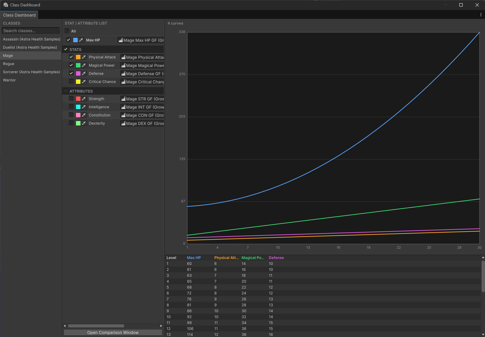
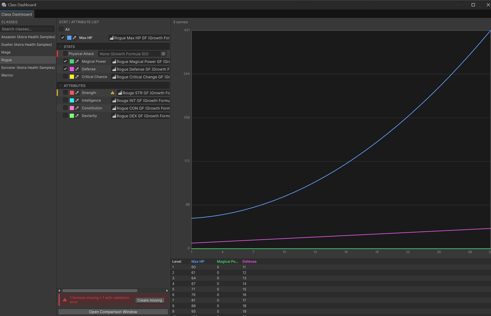
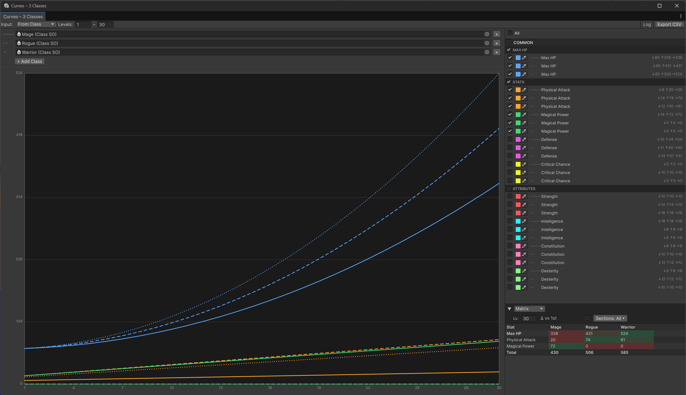
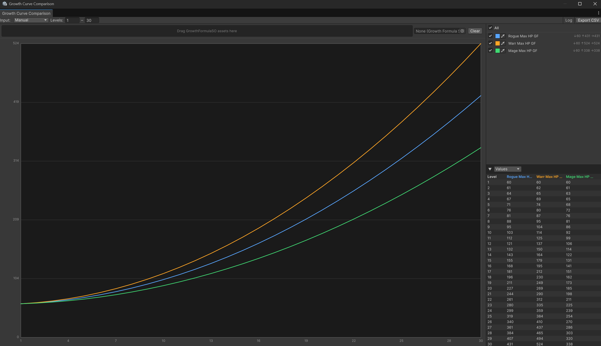
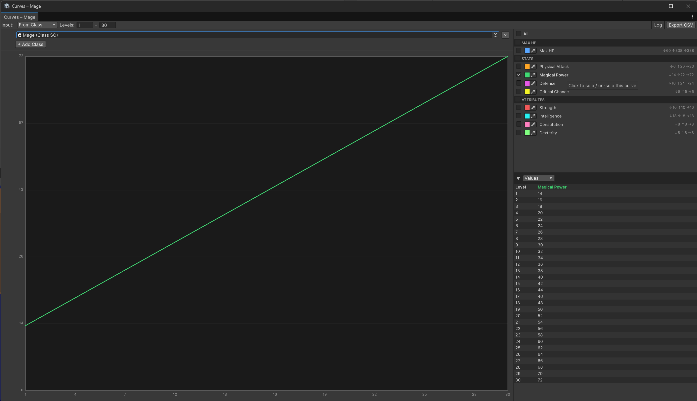
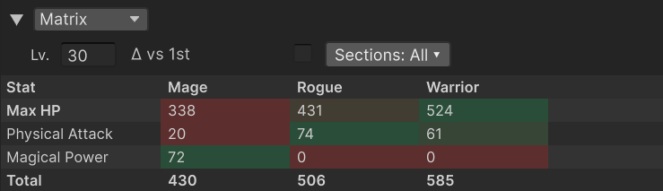
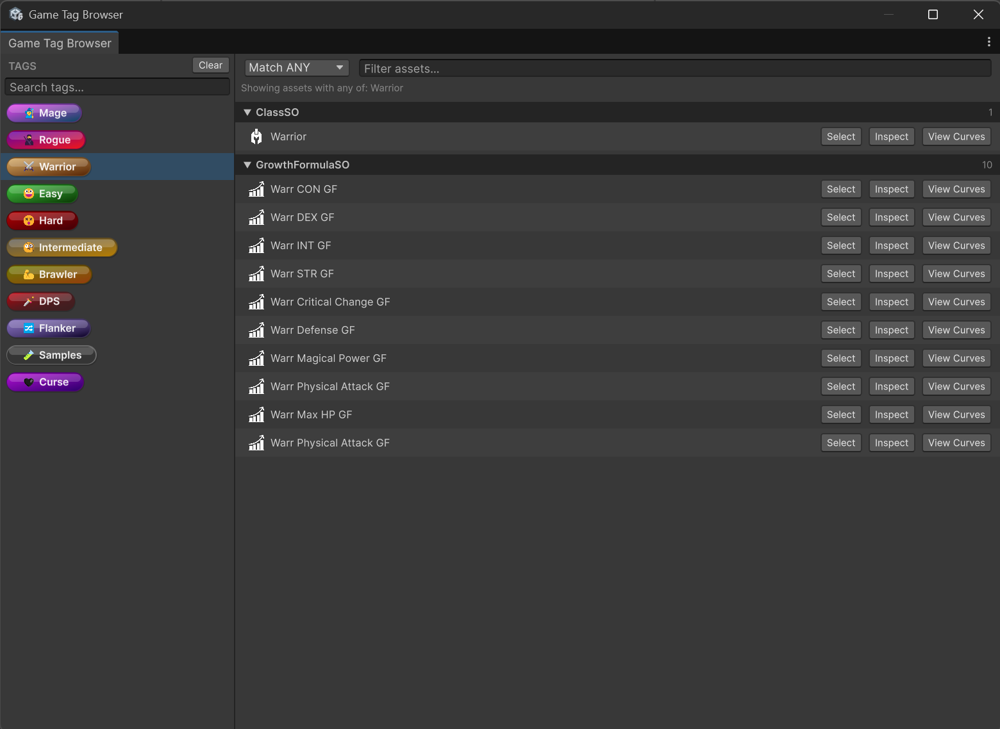

# Editor Windows

*🏷️ Version 2.1.0+*

Astra Framework ships three built-in editor windows aimed at balancing and overview work. The Class Dashboard gives you a holistic picture of a class's growth formula coverage at a glance. The Growth Curve Comparison lets you overlay and compare stat and attribute progressions across multiple classes to support balancing decisions. The Game Tag Browser lets you search and navigate project assets by their assigned tags. All three are accessible from the `Tools > Astra Framework` menu and update automatically when project assets change.

| Window | Menu path | Primary purpose |
|---|---|---|
| [Class Dashboard](#class-dashboard) | `Tools > Astra Framework > Class Dashboard` | Holistic overview of a class's growth formula coverage; spot missing or invalid formulas and jump into curve comparison |
| [Growth Curve Comparison](#growth-curve-comparison) | `Tools > Astra Framework > Growth Curve Comparison` | Overlay and compare stat and attribute progressions across up to four classes; balance stat budgets with the Matrix table |
| [Game Tag Browser](#game-tag-browser) | `Tools > Astra Framework > Game Tag Browser` | Find all assets that carry a given combination of `GameTagSO` tags |

---

## Class Dashboard

The Class Dashboard is a three-column window designed to give you a complete picture of a class's growth formula coverage in one place. From here you can immediately see which formulas are missing or invalid, assign them inline, and review all curves at once in the right panel. When you need to compare curves across multiple classes, use the **Open Comparison Window** button to bring up the Growth Curve Comparison window.

<!-- IMAGE MISSING: class-dashboard-overview.png — full window screenshot showing class list on the left, formula list in the middle, and graph/table on the right -->

### Opening the window

- `Tools > Astra Framework > Class Dashboard` — opens the window without a pre-selected class.
- From a `ClassSO` inspector — use the **Open in Dashboard** button to open the window with that class already selected.

### Class list (left panel)

The left column lists every `ClassSO` found in the project, sorted alphabetically. A search field at the top filters the list as you type. Selecting a class populates the middle column.

### Formula list (middle panel)

The middle column shows one row per growth slot in the selected class: **Max HP**, then every stat in the assigned `StatSet`, then every attribute in the assigned `AttributeSet`. Slots are grouped by section headers (**Stats**, **Attributes**).

When a class is selected for the first time in the session, all rows are checked by default, so the right panel immediately shows a full overview of every curve. Use the checkboxes, the **All** master toggle, or the per-section toggles to narrow the selection — or use [Solo / un-solo](#solo--un-solo-1) to focus on a single curve without unchecking everything else.

At the top of the list, an **All** master row contains a toggle that checks or unchecks every slot simultaneously. Each section header (**Stats**, **Attributes**) also carries its own toggle to check or uncheck all slots within that section at once.

Each individual row contains:

- A **status bar** on the left edge — red when the formula slot is empty, yellow when the assigned formula has validation errors.
- A **checkbox** — check it to include that curve in the right-panel preview.
- A **color field** — visible whenever a formula is assigned (regardless of the checkbox state). Click it to open a native color picker; the chosen color is saved to `EditorPrefs` and persists across sessions. Right-click the row to reset the color to its default. The color is shared with the Growth Curve Comparison window through the same underlying `StatColorPrefs` storage.
- The **slot name** — click to solo or un-solo the row (see [Solo / un-solo](#solo--un-solo-1)). The name is displayed in bold when the row is the active solo or when it belongs to the Max HP slot. Hovering shows a tooltip with the min, max, and final values of the curve over its full level range.
- A **⚠ warning icon** with a tooltip listing validation errors, shown when the formula exists but has errors.
- An **object field** where you can assign or reassign a `GrowthFormulaSO` directly.

<!-- IMAGE MISSING: class-dashboard-formula-health.png — close-up of the middle panel rows showing the red left bar (missing formula), yellow bar + warning icon (formula with errors), the All master row, a section header with its toggle, and the color field -->

#### Solo / un-solo

Clicking a slot name in the formula list **solos** that curve: all other checked rows are temporarily hidden in the right-panel preview so you can inspect a single progression in isolation. The name turns bold to indicate the solo state.

Clicking the same name again **un-solos** it and restores the previous checked state exactly as it was before soloing. Toggling any checkbox, the master toggle, or a section toggle also clears the solo automatically.

> [!NOTE]
> Solo is a transient, session-only state. It is not saved when switching classes or closing the window.

#### Formula health bar

When one or more slots are missing a formula or have validation errors, a status bar appears at the bottom of the middle panel. It shows the count of missing and invalid formulas and, when there are missing ones, a **Create missing** button. Clicking it opens the same growth-formula auto-creation dialog used by the `ClassSO` inspector, letting you batch-create and assign a `GrowthFormulaSO` for every empty slot in one step.

#### Open Comparison Window

The **Open Comparison Window** button at the bottom of the middle panel opens the [Growth Curve Comparison](#growth-curve-comparison) window pre-loaded with the currently selected class in **From Class** mode. Use it when you want to compare this class's curves against one or more other classes — the Class Dashboard itself is sufficient for reviewing all curves of a single class at once.

### Curve preview (right panel)

The right column shows a chart and a value table for every row that has its checkbox ticked. Check multiple rows to overlay their curves and compare values side by side.

<!-- IMAGE MISSING: class-dashboard-comparison.png — right panel with two or three curves overlaid and the value table below -->

When no rows are checked, the right panel shows a hint. When checked rows have no assigned formula, the chart is empty but the panel stays visible.

> [!TIP]
> The checked state is remembered per class within the current session. Switching to another class and back restores the same selection. A class that has never been visited in the current session always opens with all rows pre-checked.

---

## Growth Curve Comparison

The Growth Curve Comparison window is the primary balancing tool in the framework. It lets you overlay the stat and attribute progression curves of up to four classes simultaneously, inspect numeric values level by level, and compare stat budgets across classes at any target level — all from a single resizable window.

### Opening the window

- `Tools > Astra Framework > Growth Curve Comparison` — opens the window in **From Class** mode with no class pre-selected.
- **Open Comparison Window** button in the [Class Dashboard](#class-dashboard) — opens the window in From Class mode with the dashboard's current class pre-loaded.
- From a `ClassSO` inspector — opens the window (or focuses an existing one) for that class.
- From a `GrowthFormulaSO` inspector — opens the window in Manual mode, appending the formula if a Manual-mode window is already open.

### Layout

The window is split into a left pane (mode selector and chart) and a right panel (legend and table).

### Input modes

The **Input** dropdown in the toolbar switches between two modes.

#### From Class mode

In From Class mode, drop one or more `ClassSO` assets into the class fields. Up to four classes can be loaded simultaneously.

<!-- IMAGE MISSING: growth-curve-comparison-from-class.png — window in From Class mode with one class, showing the legend with Max HP / Stats / Attributes sections -->

Each class is assigned a distinct **line style** to keep curves visually distinguishable even when colors overlap:

| Class slot | Line style |
|---|---|
| 1st | Solid `───` |
| 2nd | Dashed `- -` |
| 3rd | Dotted `···` |
| 4th | Dash-dot `-·-` |

When two or more classes are loaded, the legend reorganizes into a **COMMON** section containing curves that are shared by every loaded class (same stat or attribute), followed by per-class sections for slots that are unique to each class.

<!-- IMAGE MISSING: growth-curve-comparison-multi-class.png — window with two or three classes, legend clearly showing the COMMON block and individual class blocks below -->

> [!NOTE]
> A stat or attribute is considered common when it is present in every selected class, regardless of the actual formula assigned to it.

#### Manual mode

In Manual mode, load `GrowthFormulaSO` assets by dragging them onto the drop zone or by selecting them through the picker field to the right of the drop zone. Duplicate formulas are silently ignored. Use **Clear** to remove all loaded formulas.

<!-- IMAGE MISSING: growth-curve-comparison-manual.png — window in Manual mode showing the drop zone and several formula curves -->

### Toolbar

| Control | Purpose |
|---|---|
| **Input** dropdown | Switch between From Class and Manual mode |
| **Levels** fields (From – To) | Set the level range shown on the chart and in the table |
| **Log** toggle | Switch the Y axis between linear and logarithmic scale, useful for exponential curves |
| **Export CSV** | Save the values of all visible curves to a `.csv` file |

The level range is auto-populated from the longest formula in the current set when a new source is loaded.

### Legend

The legend panel lists every loaded curve. At the top is a master **All** toggle that shows or hides all curves at once.

Below the master row, curves are grouped by section (Max HP, Stats, Attributes) when loaded from a class. Each section header has its own toggle to show or hide the entire section.

Each curve row contains:

- **Visibility toggle** — show or hide the curve individually.
- **Color swatch** — click to open a color picker. The chosen color is saved to `EditorPrefs` and persists across sessions and window instances. The same stat or attribute keeps its color across all classes loaded in the window.
- **Line-style icon** — visible in the COMMON section to indicate which class each entry belongs to.
- **Curve name** — click to solo or un-solo the curve (see below).
- **Stats summary** — shows `↓ min  ↑ max  → final` values over the current level range.

Right-clicking a row opens a context menu with **Reset Color to Default** (clears the saved color for that slot) and **Reset All Saved Colors**.

#### Solo / un-solo

Clicking a curve name in the legend **solos** that curve: all other curves are hidden so you can inspect it in isolation. The name turns bold to indicate the solo state. Clicking it again **restores** the previous visibility state for all curves.

<!-- IMAGE MISSING: growth-curve-comparison-solo.png — legend with one curve name in bold, chart showing only that single curve -->

In **From Class mode with multiple classes**, soloing a curve groups it with all curves that represent the same stat or attribute across every loaded class. For example, soloing the `Physical Attack` row of the first class also keeps the `Physical Attack` rows of the second and third class visible, so you can compare how the same stat grows differently per class without losing context.

> [!TIP]
> Use solo to focus on a single stat during balancing without manually toggling all other curves off — and un-solo with a second click to return to the full picture immediately.

### Table panel

The collapsible table panel (▼ / ▶) below the legend shows numeric values. Use the **Values / Matrix** dropdown to switch between the two table modes.

#### Values table

Values mode shows one column per visible curve and one row per level, from the **From** level to the **To** level. Up to 1 000 levels are shown inline; if the range is larger, a message at the bottom of the table directs you to Export CSV.

#### Matrix table

Matrix mode shows classes as columns and stats or attributes as rows, at a single pinned level. This is designed for cross-class balance comparisons.

<!-- IMAGE MISSING: growth-curve-comparison-matrix.png — Matrix table with three class columns, multiple stat rows, heat coloring visible, and a Total row at the bottom -->

Matrix-specific controls:

- **Lv.** field — the level at which class values are compared. Defaults to the **To** level.
- **Δ vs 1st** toggle — replaces absolute values with the signed difference relative to the first class. Cells turn green when a class is higher than the first class and red when lower.
- **Sections** dropdown — choose which sections (Max HP, Stats, Attributes) are included in the rows and in the **Total** row.

Without the Δ toggle, cells within each row are colored with a **heat map**: the lowest value in the row is red, the highest is green. This makes it easy to spot at a glance which class has the highest or lowest value for each stat at the chosen level.

A **Total** row at the bottom sums all visible stat values for each class (respecting the section filter), giving a quick measure of the overall stat budget per class.

> [!TIP]
> Use Matrix mode at key milestone levels (e.g., levels 1, 10, 20, max) to verify that class stat budgets remain balanced at each progression gate.

---

## Game Tag Browser

The Game Tag Browser lets you find every asset in the project that carries a given combination of `GameTagSO` tags. It updates automatically whenever assets are created, deleted, or modified.

<!-- IMAGE MISSING: game-tag-browser-overview.png — full window screenshot with several tags selected on the left and grouped asset results on the right -->

### Opening the window

- `Tools > Astra Framework > Game Tag Browser` — opens the window with no tag pre-selected.
- From a `GameTagSO` inspector — opens the window with that tag already selected and the matching assets shown immediately.

### Selecting tags (left panel)

The left panel lists every `GameTagSO` found in the project, rendered as pill badges identical to the ones shown in inspectors. A search field at the top filters the list by tag name.

- **Click** a tag to select it (highlight in blue) and add it to the filter. Click it again to deselect.
- **Shift+click** a tag to range-select all tags between the last clicked tag and the current one.
- **Clear** removes all selections.

The summary line in the right panel updates as you select tags to show exactly which tags the filter is currently using.

### Asset list (right panel)

The right panel shows all assets that match the selected tags, grouped by asset type. Each group is collapsible and displays a count badge.

The **Match ANY / Match ALL** dropdown in the header controls the filter logic:

- **Match ANY** (default) — includes any asset that carries at least one of the selected tags (logical OR).
- **Match ALL** — includes only assets that carry every selected tag simultaneously (logical AND).

<!-- IMAGE MISSING: game-tag-browser-match-all.png — window with Match ALL selected, two tags highlighted, and a shorter list of results -->

The **Filter assets** text field in the header filters the asset list by name within the current tag selection.

> [!NOTE]
> The tag filter and the asset-name filter are independent. You can narrow by tags first and then further narrow by asset name, or use either filter alone.

### Asset row actions

Each asset in the list has up to three action buttons:

| Button | Action |
|---|---|
| **Select** | Selects the asset in the Project window and pings it |
| **Inspect** | Opens the asset in a floating Property Editor |
| **View Curves** | Opens the [Growth Curve Comparison](#growth-curve-comparison) window for the asset — available for `GrowthFormulaSO` and `ClassSO` assets |
