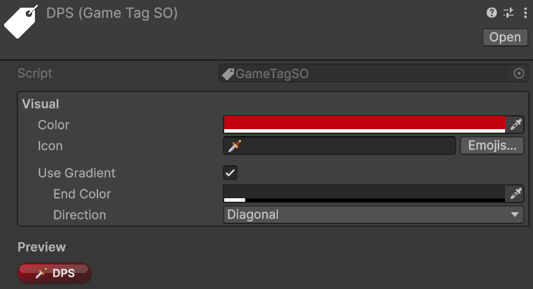
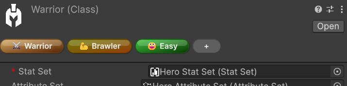
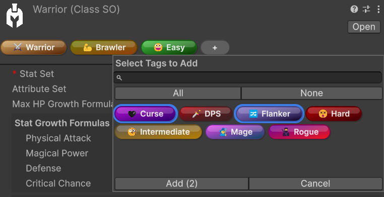
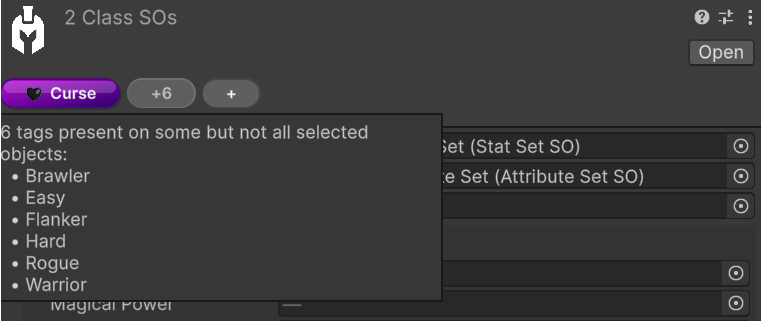

# Game Tags

*🏷️ Version 2.0.0+*

`GameTagSO` assets let you classify entities, assets, and reusable framework objects with lightweight `ScriptableObject` identifiers. Each tag can also carry visual metadata, so tagged objects are immediately recognizable in the Inspector through colored pill-style labels.

## What a `GameTagSO` contains

A `GameTagSO` asset stores:

- A primary color
- An optional icon (typically an emoji or short symbol)
- An optional two-color gradient
- A gradient direction

Assigned tags are stored through `GameTagSet`, which is the serializable container used by taggable objects. Built-in framework types that expose tags directly through `ITaggable` include:

- `EntityCore`
- `StatSO` and `StatSetSO`
- `AttributeSO` and `AttributeSetSO`
- `ClassSO`
- `GrowthFormulaSO`
- `ScalingComponentSO` and `ScalingFormulaSO`
- `IntVarSO` and `LongVarSO`
- `GameAction<TContext>` assets

This makes tags useful both for gameplay meaning and for editor organization.

## Querying tags from code

At runtime, the most direct way to work with tags is through objects that implement `ITaggable`. The `Tags` property exposes a `GameTagSet`, which provides the three core queries:

- `Contains`
- `ContainsAny`
- `ContainsAll`

For a single tag:

```csharp
if (entityCore.Tags.Contains(bossTag))
{
    Debug.Log("This entity is tagged as a boss.");
}
```

To check whether an object contains at least one tag from another set:

```csharp
if (entityCore.Tags.ContainsAny(hostileOrUndeadTags))
{
    Debug.Log("This entity matches at least one tag in the query set.");
}
```

To check whether an object contains every tag from another set:

```csharp
if (entityCore.Tags.ContainsAll(requiredLootTags))
{
    Debug.Log("This object satisfies the full tag requirement.");
}
```

These helpers make `GameTagSet` useful both for gameplay checks and for higher-level filtering logic.

## Creating a `GameTag`
*Relative path:* `Game Tag`

The custom inspector exposes a **Visual** section where you can configure the tag's appearance:

- **Color** for the main pill color
- **Icon** for an optional emoji or short symbol
- **Emojis...** to open the emoji picker
- **Use Gradient** to switch from a flat fill to a two-color gradient
- **End Color** and **Direction** when gradient mode is enabled

The inspector also shows a live preview of the resulting pill.



## Where tags appear

When the inspected target implements `ITaggable`, the framework automatically injects a tag bar directly below the default inspector header. No per-type setup is required for supported objects.

This injected header bar is the intended authoring workflow for tag editing. In tag-aware custom inspectors, the underlying serialized data may be hidden on purpose so interaction stays guided through the pill-based header UI instead of a lower-level field editor.

> [!NOTE]
> If an object does not implement `ITaggable` but still contains one or more `GameTagSet` fields, the header pills are shown in display-only mode. In that case, the header still helps you scan tags quickly, but the interactive editing workflow remains on the serialized field itself.

## Editing tags from the inspector header

### Single-object editing

When a single taggable object is selected, the header pills are fully interactive:

- Click a visible pill to ping the `GameTag` asset in the Project window
- Hover a pill to reveal the `-` remove affordance
- Click the `+` pill to open the tag selection popup
- Drag pills to reorder them



The add popup supports several quality-of-life features:

- Search by tag name
- `All` and `None` quick selection controls
- Multi-selection followed by **Add**
- Double-click on a tag to add it immediately



> [!TIP]
> Double-click is the fastest way to add a single tag. If you want to add several tags in one pass, select them in the popup first and then confirm with **Add**.

### Multi-object editing

When multiple compatible `ITaggable` objects are selected, the header still supports batch editing, but the displayed pills follow shared-state rules:

- Visible pills represent the intersection of tags present on **all** selected objects
- A grey `+N` overflow pill indicates tags that exist on only some of the selected objects
- The `+` pill adds the chosen tags to all selected objects in one batch operation
- Tags already present on every selected object are excluded from the add popup
- Tags present on only some selected objects remain selectable, so you can complete the assignment across the whole selection
- Removing a visible shared tag opens a confirmation popup listing the affected objects before the batch removal is applied

In multi-object mode, reordering and click-to-ping are intentionally not the primary workflow, because a heterogeneous selection does not have a single stable tag order.



## Pill appearance preferences

The visual pill rendering also has per-user editor preferences under:

`Edit > Preferences > Astra RPG Framework > Game Tag Pills`

These preferences let each developer customize how tag pills are presented locally in the Unity Editor. Available options include:

- **Gloss Highlight** for a glossier pill style
- **Drop Shadow** for extra separation from the inspector background
- **Icon-Only Mode** for compact visualization when the tag has an icon
- **Expand on Hover** to reveal the full label while hovering compact pills
- **Animate Expand** to make the compact expansion smoother
- **Animation Speed** to control how fast the hover expansion animates

> [!NOTE]
> These preferences only affect how pills are rendered in the local Unity Editor. They do not modify the `GameTag` asset data itself.
> **Icon-Only Mode** only affects tags that actually have an icon configured, and **Expand on Hover** / **Animate Expand** apply only when icon-only mode is enabled.

## Practical uses

`GameTag`s work well for:

- Grouping class-related assets (for example, Warrior-related formulas, abilities, and supporting assets)
- Marking gameplay categories such as factions, rarity, or behavior flags
- Organizing reusable assets like `GameAction`s, formulas, and value assets
- Making important editor objects easier to scan visually
- Supporting tag-aware runtime logic in systems that evaluate tag presence

Using tags consistently also helps keep larger projects navigable over time. Future updates may introduce custom windows and other tooling that use `GameTag`s to scan Astra assets more easily across a project — for example, to surface assets related to a Warrior class setup or to inspect collections of mob scaling formulas. Even before those tools arrive, using tags to create order in your project is already a strong long-term investment.
